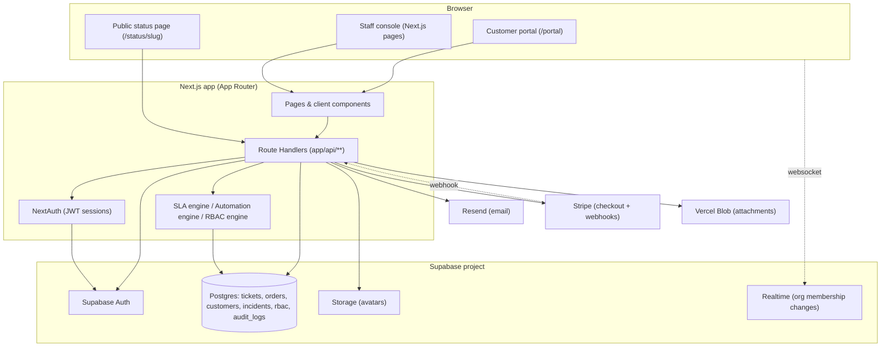

# OpsDesk

A self-hosted, multi-tenant support-operations console — tickets, orders, customers, incidents, SLA, automation, and executive reporting in one Next.js app on top of Supabase.

## Overview

OpsDesk is a single Next.js 16 / React 19 application that gives a support team one place to manage:

- **Tickets** with comments, internal notes, attachments, tags, and SLA due dates
- **Orders** with line items, status history, and Stripe-powered payment links
- **Customers** with a rolled-up activity timeline and a dedicated self-serve **customer portal**
- **Incidents** with an internal management view and a public, unauthenticated status page
- **SLA policies and an escalation engine** that auto-warns, auto-breaches, and auto-reassigns tickets
- **Automation rules** (trigger → condition → action) across tickets, orders, customers, incidents, and portal events
- **Executive analytics and scheduled report emails**
- **Org-scoped RBAC** with custom roles and an optional approval-request workflow layered on top of four built-in system roles

Everything is scoped to an "organization" (tenant); a user can belong to more than one organization and switch between them.

## Why this project exists

Based on the feature set actually implemented, OpsDesk reads as a self-hosted alternative to a bundled helpdesk/support-ops SaaS (the kind of product that combines a ticketing system, a lightweight order/billing view, a status page, and basic reporting) for a team that wants that stack on its own Supabase project instead of a third-party subscription. It is not a general-purpose CRM or project-management tool — the domain model (tickets ↔ customers ↔ orders ↔ incidents, all under SLA and RBAC) is specifically shaped around a support desk's day-to-day operations. This is an inference from the code, not a stated product brief — there is no product spec or marketing page in the repository to confirm it.

## Features

**Tickets**
Status/priority lifecycle (`open → pending → resolved → closed`), comments and internal notes, `@mention` notifications, file attachments (via Vercel Blob), tagging, and automatic SLA due-date calculation per priority.

**Orders**
Draft-to-fulfilled lifecycle with automatic payment-status derivation, line items, a full status-change audit trail, and one-click Stripe Checkout payment links emailed to the customer.

**Customers**
Rolled-up ticket/order/revenue counts and a merged activity timeline (tickets, orders, communications, and org-wide incidents) per customer.

**Incidents & public status page**
An internal incidents/services admin view plus an unauthenticated public status page (`/status/[slug]`) that only ever exposes services, incidents, and updates explicitly marked public.

**SLA engine**
Per-priority first-response/resolution targets with warning and breach events, and automatic reassignment ("auto-escalation") to a manager when a policy allows it. SLA timers are wall-clock only — there is no business-hours/calendar concept.

**Automation rules**
A configurable trigger → condition → action engine (assign role, notify role, add comment, set status/priority/payment status/severity) for tickets, orders, customers, incidents, and customer-portal events, with default seed rules per entity type.

**RBAC & approvals**
Four built-in system roles (`admin`, `manager`, `support`, `read_only`) plus per-organization custom roles with allow/deny permission overrides, and an optional approval-request workflow that can require a second person to sign off on higher-risk actions.

**Auditing**
An append-only `audit_logs` table recording who did what across team management, RBAC, tickets, orders, incidents, automation, reports, and billing, viewable in Settings → Activity.

**Auth & identity**
Email/password, Google OAuth (via Supabase), passwordless magic links, and WebAuthn passkeys, all bridged into NextAuth sessions, plus an optional email-code MFA step-up.

**Customer portal**
A separate, passwordless magic-link-authenticated portal (`/portal`) where customers can view/reply to their own tickets, upload attachments, and pay open orders via Stripe Checkout.

**Executive reporting**
Response/resolution time, incident MTTR, a response-time-based satisfaction proxy, first-contact resolution rate, backlog, and SLA compliance, with revenue/ticket-volume/customer-growth trend charts, CSV export, and schedulable emailed reports (delivery requires an externally-configured periodic caller — see [docs/DEPLOYMENT.md](docs/DEPLOYMENT.md)).

**Notifications**
In-app notifications with an SSE-based (polling under the hood) live-update stream, plus a genuine Supabase Realtime subscription that force-signs-out a user the moment every one of their org memberships is suspended.

## Architecture Overview

OpsDesk is a single Next.js app (App Router) that talks to Supabase for both identity (Supabase Auth) and data (Postgres via the Supabase client), Resend for transactional email, Stripe for payments, and Vercel Blob for file attachments. There is no separate backend service — all server logic lives in Next.js Route Handlers under `app/api/**`, and there is no Next.js `middleware.ts`; route protection is done per-page/per-route by checking the session directly.



Two things worth knowing up front because they surprise new contributors:

1. **No database-level tenant isolation for most tables.** Row Level Security is enabled only on the three purely user-scoped auth tables (`passkeys`, `passkey_challenges`, `email_mfa_challenges`); every ticket/order/customer/incident/RBAC/audit table relies entirely on every query filtering by `organization_id` in application code.
2. **Three separate identity mechanisms coexist:** a NextAuth JWT session for staff, the underlying Supabase Auth session that gets bridged into it, and a fully independent, hand-rolled magic-link session system for the customer portal.

Full subsystem-by-subsystem detail (auth flows, RBAC/approval evaluation, the SLA/automation engines, the database schema, payments/webhooks, notifications, and the frontend/state layer) belongs in **docs/ARCHITECTURE.md**.

## Technology Stack

| Layer | Technology |
|---|---|
| Framework | Next.js 16 (App Router), React 19, TypeScript |
| Auth (staff) | NextAuth v5 (beta), JWT sessions, credentials providers bridging Supabase Auth |
| Auth (passkeys) | `next-passkey-webauthn` |
| Identity / DB | Supabase (Postgres + Supabase Auth + Storage), `@supabase/supabase-js` |
| Client state | Redux Toolkit (`auth`, `topbar`, `tickets` slices) |
| UI components | Radix UI primitives, a small MUI surface (`@mui/material`), Tailwind CSS v4 |
| Tables | TanStack Table |
| Charts | Recharts |
| Forms | React Hook Form |
| Email | Resend + `@react-email/components` |
| Payments | Stripe (Checkout + webhooks) |
| File storage | Vercel Blob (ticket/order attachments), Supabase Storage (avatars) |
| Avatars | `facehash` (generated placeholder avatars) alongside a Radix-based avatar component |
| Unit/component tests | Vitest + Testing Library + jsdom |
| E2E tests | Playwright (Chromium only) |
| Lint | ESLint (`eslint-config-next`) |
| Sitemap | `next-sitemap` |

## Project Structure

```
OpsDesk/
├── app/                    # Next.js App Router: pages + app/api/** route handlers
│   ├── (auth)/              # login, register, forgot/reset password, verify
│   ├── auth/                # OAuth callback, magic-link completion
│   ├── account/             # user account/profile page
│   ├── api/                 # all server route handlers (auth, orgs, tickets, orders, ...)
│   ├── components/          # app-level components (sidebar, topbar, data table, ...)
│   ├── components/ui/       # Radix-based UI primitives
│   ├── emails/              # React Email templates
│   ├── incidents/, tickets/, orders/, customers/, reports/, settings/, ...
│   ├── portal/               # customer portal pages
│   └── status/[slug]/        # public incident status page
├── auth.ts                  # NextAuth configuration (providers, callbacks, session)
├── db/                       # standalone, hand-applied SQL schema files (see docs/DEPLOYMENT.md)
├── lib/                       # domain types/validation, Redux store, server-side engines & helpers
│   └── server/                 # RBAC, SLA engine, automation engine, Stripe, email senders, etc.
├── exports/auth-system/      # a portable snapshot of the auth subsystem for reuse in other apps
├── scripts/tinker.mjs        # manual demo/seed-data CLI (not part of the test suite)
├── tests/{unit,components,e2e}/
├── types/                    # NextAuth type augmentation
└── public/                   # static assets
```

See **docs/ARCHITECTURE.md** for what each `lib/server/*` engine does, and **docs/API.md** for the full `app/api/**` route inventory.

## Installation & Running Locally

Prerequisites: a Supabase project (Postgres + Auth + Storage), a Resend account, and (only if you need payments) a Stripe account.

```bash
npm install
```

Create `.env.local` in the repo root and set at least the variables listed below (see **docs/DEPLOYMENT.md** and **docs/SECURITY.md** for the full, feature-by-feature env-var reference). Then apply the SQL files under `db/` to your Supabase project by hand in the Supabase SQL Editor — there is no migration tool, and the files must be applied in the dependency order documented at the top of each file (`docs/DEPLOYMENT.md` spells this out in full).

```bash
npm run dev
```

The app starts on `http://localhost:3000`.

## Environment Variables

The full, per-feature environment variable reference (required vs. optional, what falls back to what, and which are unused artifacts of the Supabase/Vercel integration) belongs in **docs/DEPLOYMENT.md** and **docs/SECURITY.md**. At minimum, the app will not boot/authenticate without:

| Variable | Purpose |
|---|---|
| `NEXT_PUBLIC_SUPABASE_URL` | Supabase project URL (client + admin clients) |
| `NEXT_PUBLIC_SUPABASE_ANON_KEY` | Supabase anon key (client-side Supabase SDK) |
| `SUPABASE_SERVICE_ROLE_KEY` | Supabase service-role key (server-side admin client, bypasses RLS) |
| `NEXTAUTH_SECRET` | NextAuth JWT signing secret (also the fallback secret for several other internally-issued JWTs) |
| `NEXTAUTH_URL` | Canonical app base URL, used to build auth/email/payment redirect links |
| `RESEND_API_KEY` | Required for any transactional email (registration, magic link, MFA code, invites, payment links, reports) to send |

Payments (`STRIPE_SECRET_KEY`, `STRIPE_WEBHOOK_SECRET`), scheduled report delivery (`REPORTS_SCHEDULER_SECRET`), the inbound communications webhook (`COMMUNICATIONS_WEBHOOK_SECRET`), passkeys (`PASSKEY_*`), and the demo account (`NEXT_PUBLIC_DEMO_EMAIL`, `NEXT_PUBLIC_DEMO_PASSWORD`, `CRON_SECRET`) are feature-scoped and only required if you use those features — see the linked docs.

## Scripts

| Script | Command | Purpose |
|---|---|---|
| `dev` | `next dev` | Run the app locally |
| `build` | `next build` | Production build (also runs `postbuild`) |
| `postbuild` | `next-sitemap` | Generates `sitemap.xml`/`robots.txt` after every build |
| `sitemap` | `next-sitemap` | Regenerate the sitemap manually |
| `start` | `next start` | Run a built app |
| `lint` | `eslint` | Lint the codebase |
| `test` | `vitest run` | Run all Vitest tests once |
| `test:watch` | `vitest` | Run Vitest in watch mode |
| `test:unit` | `vitest run tests/unit` | Unit tests only (Redux slices, flow-validation helpers) |
| `test:components` | `vitest run tests/components` | Component tests only (auth pages) |
| `test:e2e` | `playwright test` | Playwright end-to-end tests (Chromium) |
| `test:e2e:headed` | `playwright test --headed` | Same, with a visible browser |
| `tinker` | `node --env-file=.env.local scripts/tinker.mjs` | Seed demo data into a Supabase project by scenario |
| `tinker:list` | `... --list-scenarios` | List available seed scenarios |
| `tinker:users` | `... --list-users` | List `public.users` rows |

## Testing

Automated coverage is currently narrow and concentrated on the authentication flows: Vitest unit tests for Redux slices and validation helpers (auth, plus ticket/order/customer status normalization in `lib/tickets/validation.ts`, `lib/orders/validation.ts`, and `lib/customers/validation.ts`), Vitest + Testing Library component tests for the login/register/forgot-password/reset-password/verify pages, and two Playwright end-to-end specs (login, register/verify). There are currently no automated tests for the tickets, orders, customers, incidents, automation, SLA, RBAC/approvals, reports, notifications, or payments API routes, UI, or broader business logic, and no CI pipeline runs any of this automatically. Details belong in **docs/TESTING.md**.

## Deployment

There is no committed CI/CD pipeline, Dockerfile, or `vercel.json` in this repository, and the database schema is applied by hand (SQL files under `db/`, no migration tool). Scheduled report emails and expired-challenge cleanup both depend on an external periodic caller that this repo does not itself provide. Full setup and operational runbook belongs in **docs/DEPLOYMENT.md**.

## Security

Notable, verified characteristics: no Next.js middleware — route protection is enforced per-page/per-route via session checks; Row Level Security is enabled on only 3 of the ~44 application tables (the rest rely on `organization_id` filtering in application code); several internally-issued JWTs (MFA assertion, passkey assertion) fall back to reusing `NEXTAUTH_SECRET` if their own secret env vars are unset; and a handful of pre-login, enumeration-sensitive endpoints (passkey lookup, passkey authenticate start/finish, the public status page) have no visible rate limiting in the application code. The full list and recommended hardening belong in **docs/SECURITY.md**.

## Known Limitations

- **No CI/CD.** No GitHub Actions or other CI config exists; nothing enforces lint/tests/build on a push or PR.
- **No Next.js middleware.** Route protection is implemented ad hoc per page/route rather than centrally.
- **No LICENSE file.** See [License](#license) below.
- **No database migration tool.** Schema changes are plain, hand-applied SQL files under `db/`, ordered only by comments at the top of each file.
- **Row Level Security covers 3 of ~44 tables.** Tenant isolation for everything else depends on consistent `organization_id` filtering in application code.
- **The report scheduler has no built-in trigger.** `POST /api/reports/schedules/run` does all the work but nothing in this repo calls it periodically — it must be wired to an external cron.
- **The notification "stream" is polling, not push.** `/api/notifications/stream` is Server-Sent Events over a 5-second server-side poll, not a database-level push.
- **Automated test coverage is limited to auth flows and a handful of ticket/order/customer validation helpers** — API routes, UI, and broader business logic remain untested (see [Testing](#testing) above).
- **The invite-resend rate limiter is in-memory** and will not work correctly across multiple server instances/replicas.
- Several smaller inconsistencies exist in the code as-read (e.g. two independently-defined, contradictory incident-severity orderings between the internal and public status routes; two different account-enumeration postures between the magic-link and forgot-password endpoints) — the full list belongs in docs/ARCHITECTURE.md and docs/SECURITY.md.

## Roadmap / What could be improved

Based on the gaps above, the highest-value next steps would be: adding a CI pipeline (lint + test + build on every push), introducing a real migration tool with tracked/applied-migration state, deciding whether to expand Row Level Security to the remaining tenant tables, wiring an external cron to `POST /api/reports/schedules/run` (and to the two expired-challenge cleanup functions), replacing the in-memory invite-resend limiter with a shared store, and extending automated test coverage beyond the authentication flows into tickets/orders/customers/incidents/RBAC. None of this is an official roadmap — it is inferred purely from the gaps discovered while documenting the codebase.

## Contributing

Contributor workflow, code style, and repository conventions belong in **docs/CONTRIBUTING.md**.

## License

**No `LICENSE` file exists in this repository.** In the absence of one, default copyright applies and the code is not licensed for reuse by anyone other than the copyright holder. If this project is intended to be open source, a `LICENSE` file needs to be added; do not assume a license from this README.

## Contact

No contact address, issue tracker link, or maintainer list is present in the repository. If you need to reach the maintainer, use whatever channel you already have outside of this repo.

## Missing Information

The following could not be verified from the repository and are not asserted anywhere above:

- A live/demo URL or deployed instance
- Screenshots or a product walkthrough
- A `LICENSE` file or stated license terms
- A CI/CD configuration (no `.github/`, no `vercel.json`, no Dockerfile/`docker-compose.yml` exist)
- A confirmed hosting platform (the dependency set and env-var naming strongly suggest Vercel + Supabase, but no committed config file confirms this)
- An enforced commit/branch-naming convention or code of conduct (this repo's `docs/CONTRIBUTING.md` documents observed practice only; nothing enforces it)
- Confirmation of what actually calls `POST /api/reports/schedules/run` in any real deployment (nothing in-repo does)
- Whether `exports/auth-system/` is regenerated by a script or kept in sync by hand
