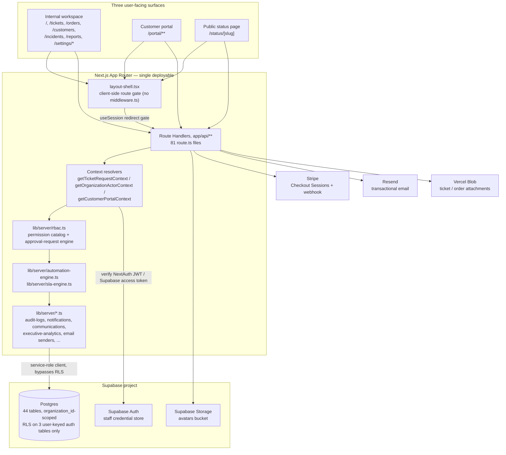
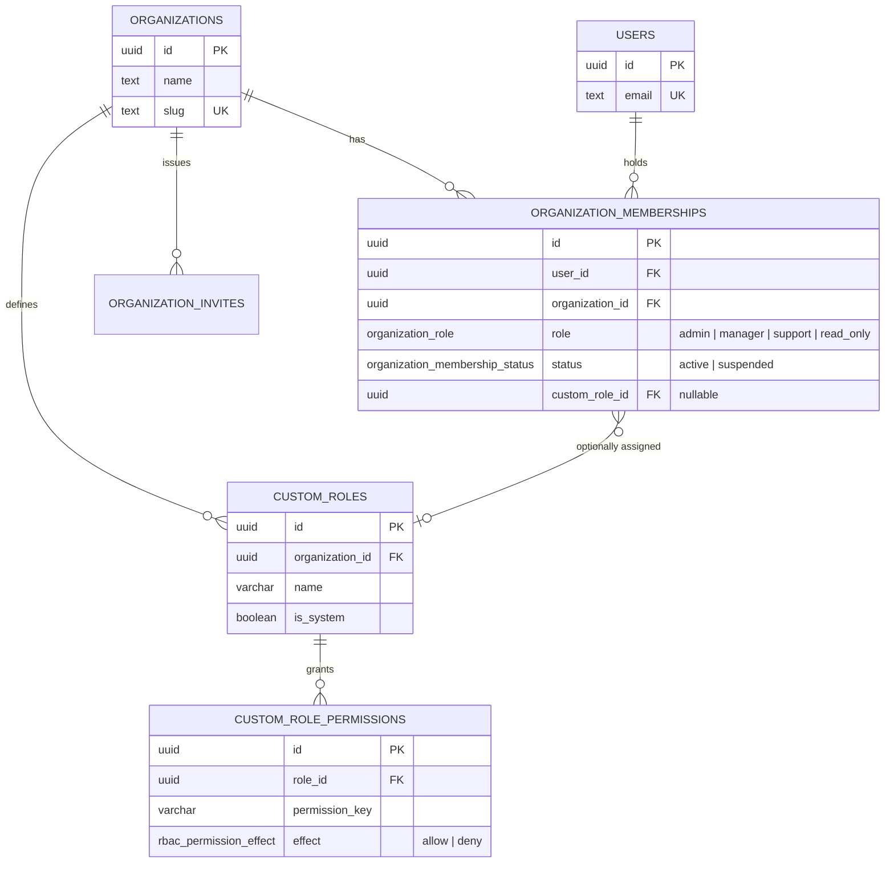
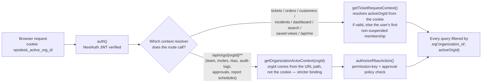
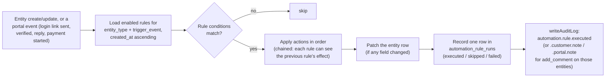
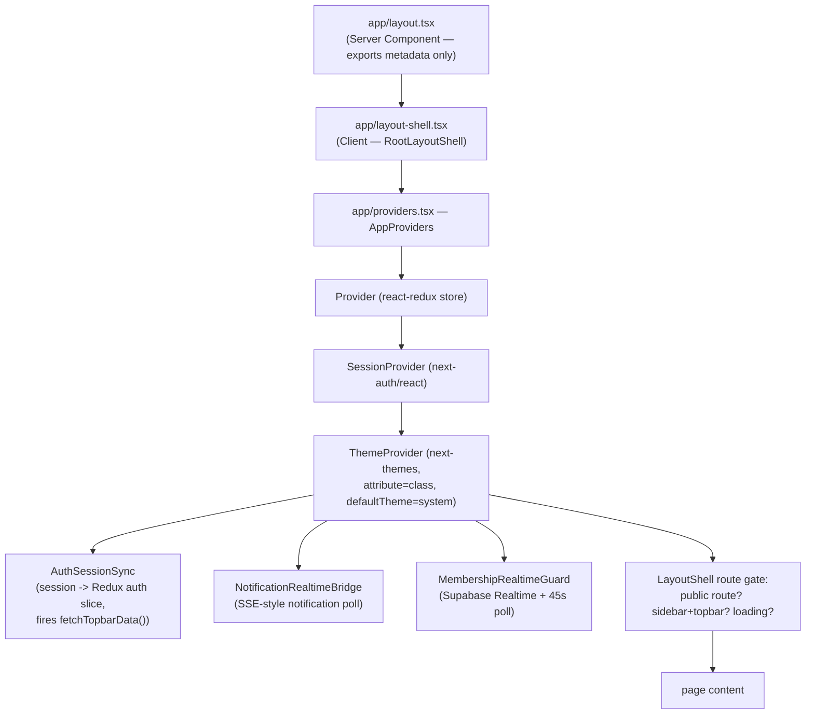
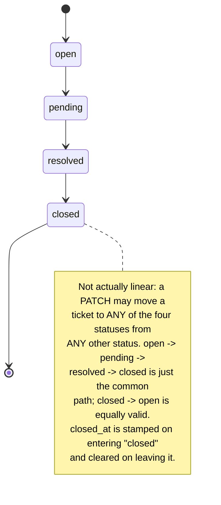
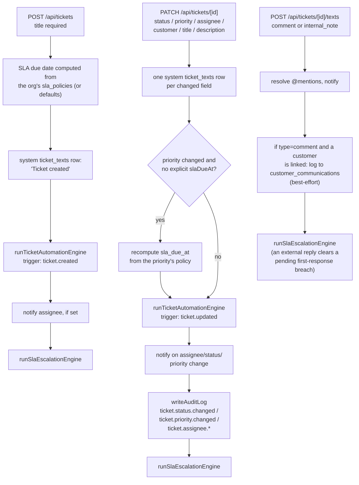

# OpsDesk — Architecture

OpsDesk is a multi-tenant support-operations console built as a single Next.js
App Router deployable. There is no separate backend service: pages, API route
handlers, and the "service layer" (`lib/server/*.ts`) all live in one codebase
and one deployment unit, talking to Supabase (Postgres + Auth + Storage),
Stripe, Resend, and Vercel Blob as external managed services.

This document describes how the pieces fit together and, where the evidence
supports it, why they were put together that way. It is grounded entirely in
the current source tree (`D:/Work Files/OpsDesk`); anything that could not be
verified is called out explicitly rather than guessed, and unresolved
questions are collected in [Missing Information](#missing-information) at the
end.

## Contents

1. [High-level system architecture](#1-high-level-system-architecture)
2. [Request flow and major subsystems](#2-request-flow-and-major-subsystems)
3. [Multi-tenant organization model and org scoping](#3-multi-tenant-organization-model-and-org-scoping)
4. [`lib/server/*` — the de facto service layer](#4-libserver---the-de-facto-service-layer)
5. [Automation engine and SLA engine](#5-automation-engine-and-sla-engine)
6. [Frontend architecture](#6-frontend-architecture)
7. [Authentication flow](#7-authentication-flow)
8. [Ticket lifecycle](#8-ticket-lifecycle)
9. [Key structural decisions and why they fit together](#9-key-structural-decisions-and-why-they-fit-together)
10. [Missing Information](#missing-information)

---

## 1. High-level system architecture

### Stack

| Layer | Technology | Notes |
|---|---|---|
| Framework | Next.js 16.1.6, App Router, React 19.2.3 | Single deployable; pages and API routes share the same process/build |
| Auth (staff sessions) | NextAuth v5 (`^5.0.0-beta.30`), JWT strategy | No database adapter configured, so sessions are stateless JWTs, not DB-backed |
| Identity/credential store | Supabase Auth | Backs staff accounts; OpsDesk's own `users`/`organizations` tables are a separate application-level mirror |
| Primary datastore | Supabase Postgres | 44 tables across 19 `db/*.sql` files, almost all `organization_id`-scoped |
| File storage | Supabase Storage (avatars), Vercel Blob (ticket/order attachments) | Two different storage backends for two different asset classes |
| Payments | Stripe Checkout (redirect-based) + webhook | No Stripe.js/Elements client-side — the server creates a Checkout Session and the browser is redirected to Stripe's hosted page |
| Transactional email | Resend, with `@react-email/components` templates | Verification, magic links, MFA codes, invites, payment links, executive reports, customer-portal access |
| Client state | Redux Toolkit (`auth`, `topbar`, `tickets` slices) | Not React Query/SWR — server data is fetched with native `fetch` and cached in Redux by hand |
| UI | Tailwind v4, shadcn/Radix primitives, Recharts | — |

### Three user-facing surfaces

OpsDesk serves three distinct audiences from the same Next.js app, each with
its own authentication mechanism:

| Surface | Routes | Who | Auth mechanism |
|---|---|---|---|
| **Internal workspace** | `/`, `/tickets`, `/orders`, `/customers`, `/incidents`, `/reports`, `/settings/*`, `/account/*`, `/notifications`, `/calendar` | Staff (org members) | NextAuth JWT session, backed by a Supabase Auth user + an active `organization_memberships` row |
| **Customer portal** | `/portal/**` | End customers (not staff, not Supabase Auth users) | A fully separate, hand-rolled magic-link + session-cookie system (`lib/server/customer-portal-auth.ts`) — no NextAuth, no Supabase Auth involvement at all |
| **Public status page** | `/status/[slug]` | Anyone with the org's slug | No authentication — `GET /api/public/status/[slug]` reads only rows explicitly flagged `is_public = true`, using the service-role Supabase client directly |

A handful of additional routes are public but don't belong to any of the
three surfaces above: the eight exact-match auth pages (`/login`,
`/register`, `/verify`, `/forgot-password`, `/reset-password`,
`/auth/callback`, `/auth/magic-link`, `/payment/thank-you`) and the
invite-acceptance flow (`/invite/[token]`), all recognized by
`app/layout-shell.tsx`'s `PUBLIC_AUTH_ROUTES`/prefix checks.

There is **no `middleware.ts`** anywhere in the repo (confirmed by a
repo-wide search — the only matches are inside `node_modules`). Route
protection is done per-request instead:

- **API routes** call a shared context resolver — `getTicketRequestContext()`,
  `getOrganizationActorContext(orgId)`, or `getCustomerPortalContext()` —
  at the top of the handler, which validates the session/cookie and 401/403s
  before any query runs.
- **Pages** are gated client-side by `app/layout-shell.tsx`, which reads
  `useSession()` from `next-auth/react` and redirects to `/login` if the
  route isn't public and the session isn't authenticated (see
  [§6](#6-frontend-architecture)).

---

## 2. Request flow and major subsystems



Almost nothing reads or writes Supabase tables directly from the browser.
The two exceptions are (a) Supabase Auth operations themselves
(`signInWithPassword`, `signInWithOAuth`, `exchangeCodeForSession`, etc. —
using the anon-key client in `lib/supabase.ts`), and (b) one Supabase
Realtime subscription on `organization_memberships` used to detect
mid-session suspension (`app/components/MembershipRealtimeGuard.tsx`, see
[§6](#6-frontend-architecture)). Every domain read/write (tickets, orders,
customers, incidents, automation, RBAC, reports, notifications, saved
views, search, dashboard) goes through a Next.js Route Handler using the
**service-role** Supabase client (`lib/supabase-admin.ts`), which bypasses
Postgres Row Level Security entirely — see [§9](#9-key-structural-decisions-and-why-they-fit-together)
for why that's the deliberate shape rather than an oversight.

---

## 3. Multi-tenant organization model and org scoping

### Data model



Every domain table (`tickets`, `orders`, `customers`, `incidents`,
`automation_rules`, `audit_logs`, `saved_views`, `analytics_report_schedules`,
…) carries a mandatory `organization_id uuid not null references
organizations(id) on delete cascade`. A user can belong to multiple
organizations (one `organization_memberships` row per org), each with:

- a **system role** (`admin | manager | support | read_only` — required), and
- an optional **custom role** (`custom_role_id`, nullable, org-scoped),
  which can layer allow/deny permission overrides on top of the system role
  via the RBAC engine (see [§4](#4-libserver---the-de-facto-service-layer)).

### How "active organization" flows through a request

A signed-in user can be a member of several organizations, but at any moment
the app only operates against one — the **active organization** — tracked by
a single httpOnly cookie, `opsdesk_active_org_id` (`ACTIVE_ORG_COOKIE`,
`lib/topbar/constants.ts`).



Two things fall out of this design worth calling out:

- **`getTicketRequestContext()`** (used by tickets/orders/customers/incidents/
  dashboard/search/saved-views and `/api/me`) is *cookie-driven* — it trusts
  whatever org the cookie names, as long as the caller has a non-suspended
  membership there. It also lazily upserts a `public.users` row on first
  call, syncing name/avatar from the Supabase Auth user.
- **`getOrganizationActorContext(orgId)`** (used by every
  `/api/orgs/[orgId]/**` route: team, invites, members, RBAC settings,
  approvals, audit logs, report schedules) is *path-driven* — the org id is
  part of the URL, not the cookie, so it re-validates the caller's
  membership+role for that specific org on every call, independent of
  whichever org is "active" in the topbar.

Both resolvers share the same suspension semantics: a membership with
`status = 'suspended'` is excluded from the caller's accessible-org set, but
a user with **zero** memberships is *not* blocked from signing in (e.g. a
freshly Google-registered user with no org yet) — suspension only fires when
`totalMemberships > 0 && activeMemberships === 0`
(`lib/server/membership-access.ts`). If the `status` column itself doesn't
exist yet (an unmigrated `organization_memberships` table), every one of
these call sites falls back to treating all memberships as active rather
than erroring — a deliberate schema-drift tolerance pattern repeated across
the entire codebase (tickets, orders, customers, incidents, automation, RBAC,
team routes all have the same fallback).

### RBAC — a second, finer-grained axis on top of org scoping

Once a request is scoped to an organization, mutating actions additionally
pass through `authorizeRbacAction()` (`lib/server/rbac.ts`), which layers:

1. A hardcoded **permission catalog** (`RBAC_PERMISSION_CATALOG`) of 25
   `action.*`/`field.*` permission keys across `team`, `billing`,
   `incidents`, `automation`, `security`, and `analytics` domains.
2. Static **system-role allow/deny patterns** (`admin` = `["*"]`,
   `read_only` = nothing, `manager`/`support` = specific subsets) as the
   baseline.
3. Optional **custom-role allow/deny overrides**, evaluated
   custom-deny → custom-allow → system-deny → system-allow, so a custom role
   can both grant extra permissions and revoke ones a system role would
   otherwise have.
4. An optional **approval-policy layer**: specific `action.*` permission keys
   can be configured (per organization) to require N approvals from a set of
   eligible roles/custom-roles before the action actually executes. When
   enabled, the mutating call returns `409 { code: "approval_required",
   approvalRequestId }` instead of applying the change, and the change only
   proceeds once an approver decides on the pending `approval_requests` row.

If the RBAC/approvals schema itself hasn't been migrated yet, `evaluatePermissionForActor`
degrades to a simple `fallbackAllowed` boolean the caller supplies (typically
`role === "admin"` or `"admin"||"manager"`) — the same graceful-degradation
pattern seen everywhere else in the schema.

---

## 4. `lib/server/*` — the de facto service layer

There is no separate backend service, ORM, or ports/adapters layer — the
closest thing OpsDesk has to a "service layer" is the flat collection of
modules under `lib/server/`. Route Handlers are thin: they resolve
auth/org/RBAC context, then call into these modules, which own all
cross-cutting business logic, external-API calls, and shared query patterns.

| Module | Owns |
|---|---|
| `ticket-context.ts` | `getTicketRequestContext()` — the common session + active-org resolver shared by tickets, orders, customers, incidents, dashboard, search, saved views, `/api/me`, and communications ingest |
| `organization-context.ts` | `getOrganizationActorContext(orgId)` — the stricter, path-bound membership+role guard for every `/api/orgs/[orgId]/**` route |
| `rbac.ts` | The permission catalog, system role allow/deny patterns, custom-role evaluation, `authorizeRbacAction()`, and the approval-request lifecycle (create, auto-approve, decide, consume) |
| `membership-access.ts` | `loadMembershipAccessSummary()` / `assertHasActiveMembership()` — computes `hasOnlySuspendedMemberships`, used both at login time (fail-open on DB error) and for the mid-session forced-signout check |
| `audit-logs.ts` | `writeAuditLog()` — the single append-only writer behind every `audit_logs` row across every domain; degrades gracefully (and silently) if the table/columns are missing, and never throws |
| `notifications.ts` | `insertAppNotifications()` — in-app notification fan-out, deduplicated per batch, best-effort (never throws) |
| `communications.ts` | `insertCustomerCommunication()` / `...Safe()` — the shared writer behind the customer-facing `customer_communications` log (staff replies, portal replies, ingest, and channel webhooks all funnel through this) |
| `text-mentions.ts` | `@mention` parsing and resolution to org member ids, shared by ticket comments and customer-portal replies |
| `automation-engine.ts` | The generic, org-configurable automation rules engine — 5 entity types × trigger events × condition matching × action execution (see [§5](#5-automation-engine-and-sla-engine)) |
| `sla-engine.ts` | SLA policy lookup/defaults, due-date computation, and the escalation sweep (warnings, breaches, auto-escalation) (see [§5](#5-automation-engine-and-sla-engine)) |
| `incidents.ts` | Status-page service-health rollup (`recalculateServiceStatuses`), slug generation, and the `canManageIncidents()` fallback-role check |
| `executive-analytics.ts` | `computeExecutiveAnalytics()` — the seven headline KPIs, trend series, and best-effort metric-snapshot persistence behind `/api/reports` and scheduled report runs |
| `executive-report-email.ts` | `sendExecutiveReportEmail()` — the only caller is the scheduled-report-run route |
| `stripe.ts` | Shared Stripe client singleton, webhook-secret accessor, and canonical app base-URL resolver |
| `customer-portal-auth.ts` | The entire bespoke customer-portal identity system: token generation/hashing, login-link + session tables, cookie handling, synthetic `users` row provisioning for portal customers |
| `customer-portal-email.ts` | `sendCustomerPortalAccessEmail()` — the magic-link email for portal sign-in |
| `order-payment-email.ts` | `sendOrderPaymentLinkEmail()` — the staff-initiated Stripe payment-link email |
| `team-invite-email.ts` | `sendTeamInviteEmail()` + `buildInviteLink()` — the org-invite email |
| `magic-link-email.ts` | The staff magic-link sign-in email |
| `mfa-assertion.ts` | Mint/verify the short-lived `email_mfa_assertion` JWT handed from the MFA-verify endpoint into the NextAuth `supabase-token` provider |
| `mfa-email-auth.ts` | Email-MFA enablement check, 6-digit code generation, HMAC hashing/constant-time comparison |
| `mfa-email-code.ts` | `sendMfaEmailCode()` — the Resend email carrying the plaintext 6-digit code |
| `passkey-config.ts` | Builds the `next-passkey-webauthn` `ServerOptions` (RP id/name/origin, Supabase adapter/store bindings) |
| `passkey-request.ts` | `resolvePasskeyUserId()` — the session/requested-userId consistency guard shared by all six passkey routes |
| `passkey-assertion.ts` | Mint/verify the short-lived `passkey_assertion` JWT handed into the NextAuth `passkey-assertion` provider |

A pattern worth naming explicitly: several of these modules (`audit-logs.ts`,
`notifications.ts`, `communications.ts`'s `...Safe()` variant) are
deliberately **best-effort and non-throwing** — a failure to log an audit
entry or fan out a notification never blocks or rolls back the primary
mutation the user actually asked for. This is consistent across every
domain (tickets, orders, customers, incidents, automation, RBAC, reports),
not a one-off choice in a single route.

---

## 5. Automation engine and SLA engine

These are the two genuinely cross-cutting **rule engines** in the codebase —
generic execution harnesses that run the same way regardless of which
domain entity triggered them, driven by data (`automation_rules`,
`sla_policies` rows) rather than hardcoded per-feature conditionals.

### Automation engine (`lib/server/automation-engine.ts`)

Rules are org-configurable, one rule set per `entity_type`, matched against
a fixed catalog of trigger events:

| Entity type | Trigger events |
|---|---|
| `ticket` | `ticket.created`, `ticket.updated` |
| `order` | `order.created`, `order.updated` |
| `customer` | `customer.created`, `customer.updated` |
| `incident` | `incident.created`, `incident.updated` |
| `portal` | `portal.auth_link_requested`, `portal.auth_verified`, `portal.ticket_replied`, `portal.order_payment_started` |

Every rule has JSON `conditions` (priority/status/payment-status/severity/
assignee-state/changed-fields filters) and a JSON `actions` array from a
fixed 7-type vocabulary (`assign_role`, `notify_role`, `add_comment`,
`set_status`, `set_priority`, `set_payment_status`, `set_severity`). One
default rule per entity type is auto-seeded per organization the first time
its rule set is fetched (e.g. "Urgent Unassigned Auto-Assign" for tickets).



Every entity type follows the same shape (match → apply → patch → log →
audit), but the concrete side effect of `add_comment` differs by entity
because each domain models "comments" differently: tickets get a real
`ticket_texts` system row, incidents get an `incident_updates` row, orders
get a note appended to `orders.notes` (no separate comments table), and
customers/portal events — which have no comment surface at all — get an
audit-log entry instead. A single rule failure never aborts the run; the
engine logs `status: "failed"` for that rule and continues to the next one.

### SLA engine (`lib/server/sla-engine.ts`)

SLA timers are per-organization, per-priority policies
(`first_response_minutes`, `resolution_minutes`, `warning_minutes`,
`escalation_role`, `auto_escalate`), seeded from hardcoded defaults (urgent:
30 min first response / 8h resolution; high: 2h/24h; medium: 4h/48h; low:
8h/72h) if an org hasn't configured its own. Timers are **pure wall-clock**
— there is no business-hours/calendar concept anywhere in the schema or
engine, so an 8-hour SLA counts nights and weekends.

The escalation sweep (`runSlaEscalationEngine`) runs synchronously — inline,
in the same request — after every ticket create, ticket update, and new
ticket reply (there is no cron job; see [§9](#9-key-structural-decisions-and-why-they-fit-together)
and [DEPLOYMENT.md](./DEPLOYMENT.md) for the operational implication). For
each open/pending ticket it checks first-response and resolution deadlines
against `now`, inserts a deduplicated `ticket_sla_events` row
(`first_response_warning` / `first_response_breached` /
`resolution_warning` / `resolution_breached` / `auto_escalated`) the first
time a threshold is crossed, and — on a resolution breach with
`auto_escalate` enabled — reassigns the ticket to a manager (or admin, if
the policy's escalation role is `admin`) other than the current assignee,
logging `ticket.sla.auto_escalated`. Event deduplication is enforced at the
database level by a unique index on
`(organization_id, ticket_id, event_type, coalesce(due_at, epoch))`, so
re-running the sweep never double-fires the same event for the same due
date — but a new due date (e.g. after a priority change recomputes
`sla_due_at`) legitimately produces a fresh set of events.

A manual "Run Escalation" action also exists (`POST /api/sla/run`,
surfaced in `/settings/sla`), gated by a hardcoded `admin`/`manager` role
check rather than the RBAC permission-key system automation rules use — a
real inconsistency between the two subsystems, not a documentation error.

---

## 6. Frontend architecture

### Layout / provider tree



`app/layout.tsx` is a Server Component — it only exports Next.js `metadata`
and renders `<RootLayoutShell>`. The actual client logic — session
awareness, redirect-to-login gating, and the public/private route split —
lives in the separate `app/layout-shell.tsx`, which:

- Redirects unauthenticated users away from any non-public route to
  `/login`, and redirects authenticated users away from the 8 exact
  auth-only routes (`/login`, `/register`, `/verify`, `/forgot-password`,
  `/reset-password`, `/auth/callback`, `/auth/magic-link`,
  `/payment/thank-you`) back to `/`.
- Deliberately does **not** apply that "already authenticated" redirect to
  `/portal/**`, `/status/**`, or `/invite/**` — an authenticated staff
  member can still view a public status page or an invite link without
  being bounced.
- Renders the full `AppSidebar` + `Topbar` shell only for private,
  authenticated routes; public routes get a bare `<main>` with just a
  fixed `ThemeToggle` and a `Toaster`.

### Redux slices

Exactly three slices are registered in `lib/store/store.ts` — no
React Query/SWR is used anywhere; server data fetched with native `fetch`
is cached by hand in these slices:

| Slice | Holds | Notable behavior |
|---|---|---|
| `auth` | `{ user: {email, name} \| null, isAuthenticated }` | Mirrors the NextAuth session; reset on logout |
| `topbar` | `MeResponse` from `GET /api/me` (user, orgs, activeOrgId, membership-access summary, unread count, org-creation eligibility) plus switching/creating flags and an `organizationChangeVersion` counter | Three thunks: `fetchTopbarData`, `switchTopbarOrganization`, `createTopbarOrganization` — each re-fetches `/api/me` afterward. `organizationChangeVersion` increments whenever `activeOrgId` changes, which other slices use as an invalidation signal |
| `tickets` | Ticket list + per-ticket detail cache + assignee roster | Supports optimistic patches (`applyOptimisticTicketPatch`) and in-memory append of new comments/attachments without a refetch; the entire cache is wiped whenever the topbar's active-org changes (reacting to the `topbar` slice's thunks via `extraReducers`), and fully reset on logout |

### Realtime bridges

Two always-mounted, render-nothing components keep the client in sync with
server-side state, using two genuinely different mechanisms:

- **`MembershipRealtimeGuard`** — a real Supabase Realtime `postgres_changes`
  subscription (using the browser anon-key client) on
  `organization_memberships`, filtered to the signed-in user's own rows,
  **plus** an independent 45-second poll as a guaranteed fallback. Either
  path calls `fetchTopbarData()`; if the refreshed data shows
  `hasOnlySuspendedMemberships: true`, the user is force-signed-out
  (`signOut({ callbackUrl: "/login?error=account_suspended" })`) — this is
  how an admin suspending every one of a user's memberships takes effect on
  an already-open tab.
- **`NotificationRealtimeBridge`** — despite the SSE framing
  (`EventSource` on `/api/notifications/stream`), the server side of this
  is a 5-second-interval poll dressed up as a Server-Sent Events stream, not
  a genuine Postgres LISTEN/NOTIFY or Supabase Realtime push. It emits two
  named events (`notifications.snapshot`, `notifications.updated`) carrying
  only counts/metadata (no notification content), which the client responds
  to by re-fetching `/api/me`. `Topbar.tsx` also independently listens for
  the same underlying `notifications:updated` window event, so a single
  server-side change can trigger two `fetchTopbarData()` calls.

---

## 7. Authentication flow

`auth.ts` registers three NextAuth `CredentialsProvider`s (confirmed at
`auth.ts:53`, `94`, `148`) — there is no NextAuth "Google" provider. Google
sign-in goes through Supabase's own OAuth client-side, and the resulting
Supabase session is bridged into NextAuth the same way password and
magic-link sessions are: via the `supabase-token` provider. Passkeys are the
one method that never touches Supabase Auth's session mechanism at all —
they mint their own short-lived assertion JWT after a WebAuthn ceremony and
bridge through a separate `passkey-assertion` provider.

```mermaid
sequenceDiagram
    participant U as Browser
    participant NA as NextAuth (auth.ts)
    participant SB as Supabase Auth
    participant API as OpsDesk API routes
    participant RS as Resend

    alt Password sign-in
        U->>SB: signInWithPassword(email, password)
        SB-->>U: session (access_token, refresh_token)
    else Magic link sign-in
        U->>API: POST /api/auth/passwordless/magic-link
        API->>SB: admin.generateLink(type=magiclink)
        API->>RS: send magic-link email
        U->>SB: exchangeCodeForSession(code) [user clicks link]
        SB-->>U: session (access_token, refresh_token)
    else Google OAuth via Supabase
        U->>SB: signInWithOAuth(google)
        SB-->>U: redirect (code or hash tokens)
        U->>SB: exchangeCodeForSession / setSession
        U->>API: POST /api/auth/oauth/account-check
        API-->>U: exists: true/false
        Note over U,API: exists:false -> shown "Account Not Found",<br/>not silently provisioned (unless intent=register)
    end

    U->>NA: signIn("supabase-token", accessToken, refreshToken)
    NA->>SB: auth.getUser(accessToken)
    NA->>NA: assertHasActiveMembership(userId)
    Note over NA: fails OPEN on a DB error;<br/>throws SuspendedAccount only if<br/>every membership is suspended

    alt multi_step_auth_enabled = true and no mfaAssertion supplied
        NA-->>U: error code = mfa_required
        U->>API: POST /api/auth/mfa/email/send (accessToken)
        API->>RS: email a 6-digit code
        U->>API: POST /api/auth/mfa/email/verify (accessToken, code)
        API-->>U: mfaAssertion (5-min JWT)
        U->>NA: signIn("supabase-token", accessToken, refreshToken, mfaAssertion)
        NA->>NA: verifyMfaAssertionToken(mfaAssertion)
    end
    NA-->>U: NextAuth session (JWT cookie)

    opt Passkey sign-in — bypasses the MFA step-up entirely
        U->>API: POST /api/passkey/authenticate/start
        U->>API: POST /api/passkey/authenticate/finish (WebAuthn ceremony)
        API-->>U: assertionToken (5-min JWT)
        U->>NA: signIn("passkey-assertion", assertionToken)
        NA->>NA: verifyPasskeyAssertionToken + assertHasActiveMembership
        NA-->>U: NextAuth session (JWT cookie)
    end
```

Notable asymmetries, verified directly against `auth.ts`:

- **Passkey sign-in never checks `multi_step_auth_enabled`.** The other two
  providers (`credentials`, `supabase-token`) require a valid `mfaAssertion`
  whenever the account has email-MFA enabled; the `passkey-assertion`
  provider's `authorize()` skips that check entirely. This reads as a
  deliberate design (a passkey is already a strong second factor) rather
  than an oversight, but it is a real, verified asymmetry worth documenting
  as such.
- **Membership suspension fails open at login** — if
  `loadMembershipAccessSummary()` itself errors (e.g. transient DB issue),
  `assertHasActiveMembership()` logs and returns rather than blocking sign-in.
  Every *other* per-request authorization check in the app
  (`getOrganizationActorContext`, `authorizeRbacAction`) fails **closed**
  (403) if it can't resolve membership. This asymmetry between login-time and
  per-request enforcement is real and should be treated as a stated policy,
  not "fixed" later as an inconsistency.
- **Google-registered users with zero org memberships are let in.** On the
  `register` intent, if `signIn("supabase-token", ...)` errors, the callback
  page deliberately swallows the error and redirects to `/` anyway — a
  brand-new user has no membership row yet, so `hasOnlySuspendedMemberships`
  can't be true, and nothing else blocks them.
- A default, un-suffixed `CredentialsProvider` (id `"credentials"`) exists in
  `auth.ts` alongside the two named above, but no call site in the app
  invokes `signIn("credentials", ...)` — every observed password sign-in
  goes directly through the Supabase SDK and then the `supabase-token`
  bridge. This provider is likely unused/vestigial.

**Customer-portal auth is a fourth, entirely independent system** —
`lib/server/customer-portal-auth.ts` implements its own magic-link request
(`POST /api/portal/auth/request-link`), single-use token verification
(`GET /api/portal/auth/verify`), and a bespoke 14-day session cookie
(`opsdesk_customer_portal`), with no NextAuth or Supabase Auth involvement.
Customers aren't Supabase Auth users at all; where a `users.id` is needed to
attribute portal-authored content (a ticket reply, an uploaded attachment),
a synthetic `users` row is lazily created and mapped via
`customer_portal_identities`.

---

## 8. Ticket lifecycle

Ticket status (`open | pending | resolved | closed`) has **no enforced
linear state machine** in code — a `PATCH` can set any status to any other
status. The only status-specific side effect at the row level is
`closed_at`: stamped on entry to `closed`, cleared on exit from it.



What *is* consistent is the side-effect pipeline that runs around every
create/update/reply:



A ticket linked to an `order_id` inherits that order's `customer_id`
permanently at create time — the API rejects any later attempt to unlink or
change the customer away from the order's own customer, and there is no
field to change `order_id` after creation at all (it's create-time only).
The SLA escalation sweep, the automation engine, and the notification/audit
writers are each invoked synchronously, inline, inside the same request —
there is no queue or background worker anywhere in this codebase.

---

## 9. Key structural decisions and why they fit together

**Service-role API routes instead of RLS-enforced direct client access.**
Postgres Row Level Security is enabled on exactly three tables — `passkeys`,
`passkey_challenges`, `email_mfa_challenges` — all keyed by `user_id`, not
`organization_id`. The other 41 tables (tickets, orders, customers,
incidents, RBAC, audit logs, reports, saved views, and the rest of the
schema) have no RLS at all. This is not simply a gap: OpsDesk's tenant
boundary isn't "a user owns a row," it's "a user has an *active* membership
with a *specific role* (and possibly a custom role with allow/deny
overrides) in a *specific* organization, and some actions additionally
require an org-configured approval workflow." That logic — role evaluation,
custom-role precedence, approval-policy lookup, "don't demote the last
active admin," "a ticket linked to an order can't change customers" — is
genuinely application logic, not something a Postgres RLS policy can
cleanly express. Because the browser is never handed a Supabase client with
direct table access for these domains (the anon-key client in
`lib/supabase.ts` is used only for Supabase Auth operations and one
Realtime subscription), every one of these 41 tables is *only* ever touched
from inside a Route Handler that has already
authenticated the caller and resolved their org/role — so the service-role
client bypassing RLS there is equivalent to a traditional server holding its
own database credentials behind an API boundary. RLS is reserved for the
three tables that hold cryptographic/authentication material scoped purely
by user identity, where a simple `auth.uid() = user_id` policy is both
sufficient and cheap. Whether this split was a deliberate, documented
decision or an artifact of how the schema evolved is not recorded anywhere
in the codebase — see [Missing Information](#missing-information).

**Two rule engines, one shape.** Automation and SLA enforcement could each
have been hardcoded per feature (e.g. "if ticket priority is urgent and
unassigned, notify a manager" as an `if` statement inside the ticket-create
route). Instead both are generic, data-driven engines: rules/policies live
in JSONB-and-enum rows per organization, and the same execution shape
(match conditions → apply actions → log a run row → write an audit entry →
best-effort notify) is reused across five entity types for automation and
across the whole ticket table for SLA. This lets an organization change its
own escalation/automation behavior from Settings UI without a code deploy,
and it means a new entity type mostly needs a new `matches*RuleCondition`/
`apply*Rule` pair rather than a new engine.

**RBAC permission keys are decoupled from the four system roles.** Rather
than hardcoding "only admins can do X," every RBAC-gated route calls
`authorizeRbacAction()` with a permission key and a *fallback* boolean
(usually `role === "admin"` or `"admin" || "manager"`). This means the
four built-in roles remain the default, zero-configuration behavior for
every new organization, while any org that wants finer control can layer
custom roles and approval policies on top without OpsDesk needing two
separate authorization code paths — the fallback *is* the pre-custom-RBAC
behavior, and the custom-role/approval-policy logic only activates once an
org actually configures it (and degrades back to the fallback if the RBAC
schema migration hasn't been applied yet).

**Passkeys and Supabase-session methods use different NextAuth providers
because they produce fundamentally different credentials.** Password,
magic-link, and Google sign-in all end with the browser holding a live
Supabase Auth session (`access_token`/`refresh_token`), so all three share
one bridge provider (`supabase-token`) that validates that token and checks
membership/MFA. A passkey ceremony never touches Supabase Auth's session
mechanism — it's verified entirely against the app's own `passkeys` table
via the `next-passkey-webauthn` library — so it needed its own provider
(`passkey-assertion`) built around a short-lived, OpsDesk-minted JWT instead
of a Supabase access token.

**A separate identity system for customers, rather than provisioning them as
Supabase Auth users.** Every customer who might reply to a ticket or pay an
order would otherwise need a full Supabase Auth account (password or OAuth
identity) just to authenticate once. Instead, `lib/server/customer-portal-auth.ts`
implements a minimal, purpose-built mechanism: a hashed single-use magic-link
token, a separate session table with its own cookie, and a lazily-created
synthetic `users` row only when portal-authored content needs a `user_id` to
attribute to. This avoids putting every customer through the (staff-oriented)
NextAuth/Supabase Auth pipeline for a much lighter-weight need.

**Best-effort side effects never block the primary action.** Audit logging,
in-app notifications, and customer-communication logging are all
implemented as non-throwing writers (`writeAuditLog`, `insertAppNotifications`,
`insertCustomerCommunicationSafe`) that swallow their own errors and only
`console.error`. This is consistent everywhere these are called: a ticket
status change, an order payment, an incident update, or an automation rule
firing all succeed for the user even if the corresponding audit/notification
insert fails — the reasoning being that losing an audit row or a
notification is a materially smaller problem than failing the operation the
user actually asked for.

**No middleware, no queue, no scheduler daemon — everything runs inline,
synchronously, per-request.** There is no `middleware.ts`, no background job
runner, and no committed cron configuration anywhere in the repo. Route
protection, the SLA escalation sweep, and the automation engine all run
inline inside the Route Handler that triggered them. This keeps the whole
system easy to reason about (a request either finishes having done
everything, or the engines it triggered are simply not run for a request
that never happens), at the cost of a genuine gap for anything meant to run
on a timer: `POST /api/reports/schedules/run` (the executive-report
"scheduler") and the two `cleanup_expired_*_challenges()` SQL functions all
require an external caller/cron that does not exist inside this repository
— see [DEPLOYMENT.md](./DEPLOYMENT.md).

---

## Missing Information

The following architecture-relevant points could not be verified from the
repository and should not be treated as confirmed until checked with the
team:

- **Hosting platform is inferred, not confirmed.** Circumstantial evidence
  (`@vercel/blob` dependency, Vercel-Supabase-integration-style `POSTGRES_*`
  env vars, `public/vercel.svg`) points to Vercel, but no `vercel.json`,
  Dockerfile, or CI config is committed anywhere in the repo to confirm the
  actual deploy target or process.
- **Whether the RLS-on-3-tables-only split (§9) was a deliberate design
  decision or an artifact of incremental schema evolution is not recorded
  anywhere.** No ADR, comment, or README section explains it either way.
- **`exports/auth-system/`** is a structurally identical duplicate of the
  auth-related `app/`, `db/`, `lib/`, `types/` subtrees, explicitly framed
  (in its own README) as a portable snapshot for copying into another
  Next.js app. No generator script or sync mechanism was found — it is
  unclear whether it's regenerated by tooling or hand-maintained, and it is
  included in both `tsconfig.json`'s and ESLint's scope (only `node_modules`
  is excluded from either).
- **Three different realtime/refresh mechanisms coexist with no recorded
  rationale**: a genuine Supabase Realtime subscription for membership
  changes (with a 45s poll fallback), 5-second polling dressed as an SSE
  stream for notifications, and a Postgres realtime-publication migration
  for the `notifications` table (`db/notifications-realtime.sql`) that no
  client code appears to subscribe to.
- **Two independently-defined severity rankings for incident/service health
  disagree with each other**: `lib/server/incidents.ts`'s `HEALTH_RANK`
  ranks `maintenance` as the most severe state, while
  `app/api/public/status/[slug]/route.ts`'s own `HEALTH_RANK` ranks
  `maintenance` as only slightly worse than `operational` — a confirmed
  contradiction between the internal admin logic and the public status-page
  logic, not yet reconciled anywhere in the source.
- **No confirmed caller exists anywhere in the repo for
  `POST /api/reports/schedules/run`** (no `vercel.json`, no CI workflow, no
  script) — the endpoint exists and is fully implemented, but nothing
  invokes it periodically; an external cron must be wired up for scheduled
  executive report emails to ever actually send.
- **The default, un-suffixed `"credentials"` `CredentialsProvider` in
  `auth.ts`** has no discoverable caller anywhere in the read files — likely
  vestigial, but not confirmed either way.
- **`next-passkey-webauthn` package internals** (challenge generation,
  counter/replay checks, RP-ID/origin enforcement) are a third-party
  dependency outside this repository; only OpsDesk's own wiring code
  (`lib/server/passkey-config.ts`, `passkey-request.ts`, `passkey-assertion.ts`,
  and the six `/api/passkey/*` route handlers) has been verified directly.
