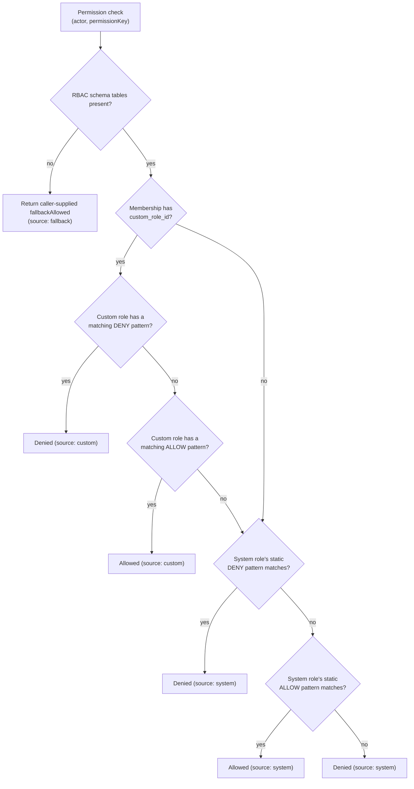

# OpsDesk — Security Architecture

This document describes how authentication, sessions, authorization, multi-tenant
isolation, secrets, and webhook verification are actually implemented in the
OpsDesk codebase today. It is a descriptive account grounded in a file-level
audit of `auth.ts`, `lib/server/**`, `app/api/**`, and `db/*.sql` — not a
penetration-test report and not a statement of intended/future design. Where the
underlying investigation could not confirm a claim (e.g. because a file was
third-party code or outside the read scope), that is stated explicitly rather
than assumed. All file paths are relative to the repository root.

Values of secrets are never included below — only environment variable names
and how they are used.

---

## 1. Authentication mechanisms

OpsDesk has two entirely separate user populations with two entirely separate
authentication systems:

1. **Staff/workspace users** — authenticated via NextAuth v5 (`auth.ts`), with
   Supabase Auth as the underlying credential store.
2. **Customers** — authenticated via a bespoke, NextAuth-independent
   passwordless session system for the customer portal (`lib/server/customer-portal-auth.ts`).
   See [Section 2.3](#23-a-third-independent-session-customer-portal).

This section covers population 1. For every staff sign-in method, the pattern
is: authenticate against Supabase Auth (or verify a short-lived, purpose-built
JWT) inside a NextAuth `authorize()` function, then let NextAuth mint its own
session on top. `auth.ts` registers exactly three NextAuth
`CredentialsProvider`s — there is no NextAuth "Google" provider; Google
sign-in happens through Supabase's OAuth and is bridged in.

| Method | User-facing entry point | NextAuth provider used | Backing check |
|---|---|---|---|
| Email + password | `/login` → `supabase.auth.signInWithPassword` (client-side) | `supabase-token` (bridge) | Supabase password auth, then `assertHasActiveMembership` |
| Google OAuth | `/login`, `/register` → `supabase.auth.signInWithOAuth({provider:"google"})`, completed at `/auth/callback` | `supabase-token` (bridge) | Supabase OAuth session, then `assertHasActiveMembership`; non-registration sign-ins are also checked against `/api/auth/oauth/account-check` |
| Magic link | `/login` → `POST /api/auth/passwordless/magic-link`, completed at `/auth/magic-link` | `supabase-token` (bridge) | Supabase `magiclink` verification, then `assertHasActiveMembership` |
| Passkey / WebAuthn | `/login` → `next-passkey-webauthn` client hook, ceremony against `/api/passkey/authenticate/*` | `passkey-assertion` | Verified WebAuthn assertion → short-lived `assertionToken` JWT → `assertHasActiveMembership` (no MFA step) |
| Email MFA step-up | Triggered mid-flow from any of the above if `user_metadata.multi_step_auth_enabled === true` | n/a (feeds `mfaAssertion` into `supabase-token`) | 6-digit emailed code, hashed and rate-limited server-side |
| Default `credentials` provider | Registered in `auth.ts` (id defaults to `"credentials"`) | `credentials` | Same `signInWithPassword` + `assertHasActiveMembership` logic as the bridge, but **no call site invoking `signIn("credentials", …)` was found** anywhere in the pages read. It is still a live, registered provider reachable via NextAuth's own callback route even though the UI does not appear to use it — see [Known Gaps](#known-gaps--not-verified). |

### 1.1 Email + password

The login page calls `supabase.auth.signInWithPassword` directly (not
NextAuth's own `credentials` provider), then bridges the resulting Supabase
session into NextAuth by calling `signIn("supabase-token", { accessToken,
refreshToken })`. Inside `auth.ts`'s `supabase-token` provider
(`auth.ts:94-147`):

1. `supabase.auth.getUser(accessToken)` validates the Supabase access token.
2. `assertHasActiveMembership(data.user.id)` (see [Section 7](#7-suspended-accountmembership-gating)) throws if every organization membership the user has is suspended.
3. If `user_metadata.multi_step_auth_enabled === true`, a valid `mfaAssertion` JWT is required or the provider throws `MfaRequired` (`code: "mfa_required"`).

Password change on the account-settings side (`PATCH /api/me/profile`) enforces
a minimum length of 8 characters. Invite-acceptance account creation
(`POST /api/invites/[token]/accept`) enforces a minimum of 6 characters. The
plain registration endpoint (`POST /api/auth/register`) was not confirmed to
enforce any minimum password length beyond Supabase Auth's own default — this
three-way inconsistency is real (verified against each route) and is called
out again in [Known Gaps](#known-gaps--not-verified).

### 1.2 Google OAuth (via Supabase)

`supabase.auth.signInWithOAuth({ provider: "google", options: { redirectTo }})`
is invoked client-side; the redirect lands on `/auth/callback`
(`app/auth/callback/page.tsx`), which exchanges the PKCE code (or parses
implicit-flow tokens from the URL hash) for a Supabase session, then:

- For a **registration intent** (`?intent=register`), the account is stamped
  `user_metadata.registered_via_opsdesk = true` and the account-existence
  check is skipped. Notably, if the subsequent `signIn("supabase-token", …)`
  call fails for a brand-new Google-registered user (because they have no
  organization membership yet), the error is deliberately swallowed and the
  user is still routed into the app — a new membership-less account is not
  blocked by `assertHasActiveMembership`, since that check only fires on
  *existing* memberships that are all suspended, not on zero memberships.
- For a normal **login intent**, `POST /api/auth/oauth/account-check` must
  confirm the account already exists (via `user_metadata` markers, an invite
  flag, or a row in `users`/`organization_memberships`) before the sign-in is
  allowed to proceed — otherwise the user is signed out of Supabase and shown
  an "Account Not Found" screen. This prevents Google sign-in from silently
  creating a new OpsDesk account outside the explicit registration flow.

### 1.3 Magic link (passwordless)

`POST /api/auth/passwordless/magic-link` first checks that the requested email
belongs to a **registered** Supabase Auth user (via a paginated
`admin.listUsers` scan) and returns `404` if not — this makes the magic-link
request endpoint account-enumerating **by design**, in explicit contrast to
the forgot-password endpoint below, which is deliberately non-enumerating.
This is a genuine inconsistency in security posture between two structurally
similar "email me a link" flows; see [Known Gaps](#known-gaps--not-verified).

On success, a Supabase `magiclink` is generated via `admin.generateLink` and
emailed through Resend. Completion at `/auth/magic-link` exchanges the
link's tokens for a Supabase session and bridges into NextAuth the same way
as password sign-in, including the same MFA step-up branch.

Password reset (`/forgot-password` → `POST /api/auth/forgot-password`) is the
mirror-image flow and is intentionally non-enumerating: it always returns the
same generic message regardless of whether the email exists (the source code
comment explicitly states this is to prevent account-existence inference).
The actual password change on `/reset-password` happens client-side via
`supabase.auth.updateUser({ password })` using the adopted recovery session —
no OpsDesk API route is involved in the password mutation itself.

### 1.4 Passkeys / WebAuthn

See [Section 8](#8-passkey-rporigin-configuration-and-secure-context-requirement)
for the full treatment of RP/origin configuration. In brief: passkey sign-in
completes a WebAuthn ceremony via `next-passkey-webauthn` against
`/api/passkey/authenticate/start` and `/api/passkey/authenticate/finish`, the
latter minting a 5-minute JWT (`assertionToken`, signed with
`PASSKEY_ASSERTION_SECRET` or a fallback secret) that is exchanged for a
NextAuth session via the `passkey-assertion` provider.

**Passkey sign-in does not go through the email-MFA step-up at all** — unlike
the other two providers, `auth.ts`'s `passkey-assertion` branch
(`auth.ts:148-195`) calls `assertHasActiveMembership` but never checks
`isMultiStepAuthEnabled` or requires an `mfaAssertion`. This reads as a
deliberate design choice (a passkey is itself a strong second factor), but it
is a real, verifiable asymmetry between the three sign-in providers, not an
inference.

### 1.5 Email MFA step-up

A second factor, independent of which primary method was used, gated purely
by the flag `user_metadata.multi_step_auth_enabled` (toggled by the user via
`PATCH /api/me/profile`):

- `POST /api/auth/mfa/email/send` — requires a valid Supabase access token,
  generates a 6-digit code (`crypto.randomInt(0, 1_000_000)`, zero-padded),
  stores only its hash (`code_hash`) plus `attempt_count: 0` in
  `email_mfa_challenges` (upserted per user, so a fresh send always replaces
  the previous code and resets attempts), and emails the plaintext code via
  Resend. A per-user 45-second resend cooldown is enforced
  (`MFA_EMAIL_CODE_COOLDOWN_SECONDS`).
- `POST /api/auth/mfa/email/verify` — validates the 6-digit format, loads the
  challenge row, rejects if expired (10-minute TTL,
  `MFA_EMAIL_CODE_TTL_MINUTES`) or if `attempt_count >= 5`
  (`MFA_EMAIL_CODE_MAX_ATTEMPTS`, deletes the row and returns `429`).
  Comparison is a SHA-256 hash of `${code}:${secret}` checked with
  `crypto.timingSafeEqual` (constant-time). On success the challenge row is
  deleted and a 5-minute `mfaAssertion` JWT is minted
  (`type: "email_mfa_assertion"`, secret `MFA_ASSERTION_SECRET` or fallback).

That `mfaAssertion` is what the client then passes into
`signIn("supabase-token", { accessToken, refreshToken, mfaAssertion })`, and
`auth.ts` verifies it (`verifyMfaAssertionToken`, checking the token's
`sub` against the authenticating user id) before completing sign-in.

### 1.6 The non-functional `/verify` page

`app/(auth)/verify/page.tsx` compares a `?code=` query-string value against
user input using a **purely client-side string comparison** — it makes no
network call and verifies nothing against server state. No code path found in
the auth pages links to it with a real, server-issued code (the actual email
verification is the Supabase `signup`-link flow used by
`POST /api/auth/register`, which redirects to `/login?verified=true`, not to
`/verify`). Do not treat `/verify` as an active verification control; it
appears to be decorative/unfinished.

---

## 2. Session model

### 2.1 NextAuth session (staff)

NextAuth v5 is configured with **JWT-strategy sessions** — no database adapter
is configured in `auth.ts`, and no `session.strategy` override is set, so
NextAuth defaults to JWT. Confirmed structurally: `auth.ts`'s `callbacks.jwt`
and `callbacks.session` manipulate `token`/`session.user.id` directly (there is
no session-table lookup), and `types/next-auth.d.ts` augments the `JWT`
interface with a custom `userId?: string` field, which only makes sense under
the JWT strategy.

- **What's on the token**: on initial sign-in, whatever `id` the matched
  provider's `authorize()` returned is stored as `token.userId`
  (`auth.ts:201-207`).
- **What's on the session**: `session.user = { id, name, email, image }`
  (`types/next-auth.d.ts`), with `id` resolved as `token.userId ?? token.sub ?? ""`.
  No organization id, role, or MFA status is embedded in the session token —
  those are fetched per-request from `GET /api/me` and re-derived from the
  database on every API call that needs them (see [Section 3](#3-authorization-rbac--approval-queues)
  and [Section 4](#4-multi-tenant-data-isolation)).
- **Signing secret**: `NEXTAUTH_SECRET`, used both for the NextAuth session
  token itself and, when their own dedicated env vars are unset, as a
  **shared fallback secret** for three otherwise-unrelated, separately-signed
  JWTs — see [Section 5](#5-secrets-and-service-role-key-usage).
- **Sign-in page override**: `pages.signIn = "/login"` — NextAuth redirects
  unauthenticated/error flows there.
- **Cookie**: `auth.ts` does not set a custom `cookies` configuration, so the
  session cookie uses NextAuth's own default name and attributes; nothing in
  the audited code overrides them.

### 2.2 A second, parallel Supabase session (same browser, different mechanism)

Every staff sign-in method also produces a Supabase Auth session in the
browser, managed independently by the `@supabase/supabase-js` client
(`lib/supabase.ts`, anon key). This is a genuinely separate session
mechanism from the NextAuth JWT/cookie, and the two are not automatically
kept in lockstep — the application code has to do it explicitly. The clearest
example: when NextAuth's `supabase-token` provider rejects a sign-in with
`account_suspended`, the client explicitly calls `supabase.auth.signOut()`
even though no NextAuth session was ever created, specifically to avoid
leaving a live Supabase session for an account that was just denied entry.

### 2.3 A third, independent session: customer portal

The customer-support-portal (`app/portal/**`, `app/api/portal/**`) uses a
**fully separate, hand-rolled, passwordless session system**
(`lib/server/customer-portal-auth.ts`) with no NextAuth involvement at all:

- Login links and sessions are both 32-byte random tokens
  (`randomBytes(32).toString("hex")`); only the SHA-256 **hash** of each token
  is ever persisted (`customer_portal_login_links.token_hash`,
  `customer_portal_sessions.token_hash`) — the raw token exists only in the
  emailed link or the session cookie.
- Login links expire after 20 minutes and are single-use (`used_at` is
  stamped on consumption). Sessions are valid for 14 days from creation, with
  **no sliding-window renewal** — `last_seen_at` is touched on activity, but
  `expires_at` is not extended.
- The session cookie (`opsdesk_customer_portal`) is `httpOnly`,
  `sameSite: "lax"`, `secure` in production, scoped to `path: "/"`.
- A customer whose record transitions to `status: "blocked"` is locked out
  **immediately**, even mid-session: `getCustomerPortalContext()` re-checks
  the customer's current status on every call and returns `null` (unauthenticated)
  if blocked, regardless of whether the session token itself is still
  unexpired.
- Request-link creation is rate-limited (max 3 requests per email per 60
  seconds) and non-enumerating (always returns the same generic success
  message, matching the forgot-password pattern rather than the magic-link
  pattern described above).

This is a distinct trust boundary from the staff NextAuth session and should
not be conflated with it when reasoning about auth coverage — a vulnerability
or fix in one system does not automatically apply to the other.

---

## 3. Authorization (RBAC + approval queues)

### 3.1 Roles

Every organization membership (`organization_memberships`) carries exactly one
**system role** — `admin | manager | support | read_only`
(`organization_role` Postgres enum) — and optionally one **custom role** via a
nullable `custom_role_id` pointing at an org-scoped `custom_roles` row. Custom
roles carry a list of `{ permission_key, effect: "allow"|"deny" }` rows in
`custom_role_permissions`, where `permission_key` may itself be a wildcard
pattern.

### 3.2 Permission evaluation

The permission catalog (`RBAC_PERMISSION_CATALOG` in `lib/server/rbac.ts`)
defines two kinds of keys: `action.*` (gates an operation) and `field.*`
(gates a specific field value within an operation, e.g. which system role can
be assigned). Evaluation order (`evaluatePermissionForActor`), deny-beats-allow
and custom-beats-system:

Static system-role defaults: `admin` allows `"*"` (everything) with no deny
list; `read_only` allows nothing and explicitly denies `"*"`; `manager` and
`support` have curated allow lists (team/approvals/analytics/incidents/
automation-scoped for manager; a narrower analytics-view/incidents set for
support) plus explicit deny entries for the highest-risk actions
(`action.rbac.manage`, role-assignment fields, member removal, etc.).

**Fail-safe on missing schema**: if the RBAC tables (`custom_roles`,
`custom_role_permissions`, `approval_policies`, `approval_requests`, etc.)
haven't been migrated into a given database yet, the check degrades to
whatever boolean the *calling route* passed as `fallbackAllowed` (almost
always a plain `role === "admin"` or `role === "admin" || role === "manager"`
check) rather than throwing. This means an org that hasn't run
`db/rbac-approvals-schema.sql` is protected only by that simpler hardcoded
role check, not by the full custom-role/approval engine.

### 3.3 Approval queues

Any `action.*` permission check can optionally be routed through an
org-configured approval workflow by passing `useApprovalFlow: true` at the
call site — this is opt-in per permission key and only takes effect if an org
admin has enabled an `approval_policies` row for that exact key. When active:

- If the actor already has an approved-but-unused request for the same
  permission + entity, it is atomically consumed and the action proceeds.
- Else if a pending request already exists for that actor/permission/entity,
  the route returns `409` with `{ code: "approval_required", approvalRequestId }`
  and the underlying mutation does **not** happen in that request cycle.
- Else a new `approval_requests` row is created. Eligible approvers are active
  members whose system role is in the policy's `approver_roles` (default
  `["admin"]`) or whose custom role is in `approver_custom_role_ids`,
  excluding the requester. **If no eligible approver exists, the request is
  auto-approved and consumed immediately** (logged as
  `approval.request.auto_approved`) — this is a real fallback path, not a
  guess, and is worth knowing: an approval policy with an approver-role set
  that resolves to zero actual members provides no gate at all.
- Decisions (`decideApprovalRequest`) reject self-approval (`403` if
  `requested_by === decider`) and reject non-approvers (`403`). A single
  `rejected` decision terminates the request; `approved` decisions accumulate
  until `min_approvals` is met.

Field-level (`field.*`) permission checks and read/list-style checks are
always called with `useApprovalFlow: false` in the routes reviewed — only
higher-risk `action.*` mutation keys are ever approval-gateable in practice.

### 3.4 Inconsistent gating across subsystems

Two real inconsistencies worth flagging explicitly rather than assuming a
single, uniform authorization model applies everywhere:

- **SLA settings bypass the RBAC engine entirely.** `PATCH /api/sla/policies`
  and `POST /api/sla/run` use a hardcoded
  `actorRole === "admin" || actorRole === "manager"` check with no
  permission-key indirection and no approval-flow option — unlike Automation
  Rules (`/api/automation/rules*`), which use the full
  `action.automation.rules.manage` / `action.automation.rules.delete`
  permission-key + approval-flow system. A custom role cannot be delegated
  SLA-management access the way it can be delegated automation-rule access.
- **`GET /api/reports` performs no RBAC check at all**, even though the
  permission catalog defines an `action.analytics.reports.view` key —
  the route only requires an authenticated session with an active
  organization (`getTicketRequestContext()`), not `authorizeRbacAction`. The
  catalog key currently appears to be declared but not enforced on this
  specific route.

---

## 4. Multi-tenant data isolation

Every domain table (`tickets`, `orders`, `customers`, `incidents`,
`automation_rules`, `custom_roles`, `approval_requests`, `audit_logs`,
`saved_views`, `customer_communications`, `analytics_*`, and more — roughly
37 tables) carries a `organization_id uuid not null references organizations(id)`
column. **None of these tables have Postgres Row Level Security enabled.** A
full read of every file under `db/` found zero
`alter table ... enable row level security` or `create policy` statements
referencing `organization_id` anywhere in the schema. Tenant isolation for
this entire business-data surface is enforced **exclusively at the
application layer** — every route filters its own Supabase queries by
`organization_id`, resolved per-request from either the `opsdesk_active_org_id`
cookie (validated against the caller's actual memberships,
`lib/server/ticket-context.ts`) or the `orgId` URL path segment (validated the
same way, `lib/server/organization-context.ts`). There is no database-level
backstop if an application code path forgets that filter.

RLS **is** enabled on exactly two auth-adjacent, user-scoped (not org-scoped)
table groups:

| Tables | Policy pattern |
|---|---|
| `public.passkeys`, `public.passkey_challenges` | Self-access via `auth.uid()::text = user_id`; service-role bypass via `auth.role() = 'service_role'` |
| `public.email_mfa_challenges` | Same pattern |

These policies only constrain access paths that go through Supabase's
row-level-security-aware clients using a caller's own JWT (i.e. `auth.uid()`
must resolve to something). In this codebase, essentially all server-side
reads/writes — including to these same two RLS-protected table groups — go
through `createSupabaseAdminClient()`, the service-role client, which bypasses
RLS unconditionally. The application's own authorization logic (session
checks, membership checks, the RBAC engine above) is therefore the real
enforcement point for these tables too, in practice; the RLS policies are a
secondary backstop that only matters if some other, non-service-role client
ever queries these two table groups directly.

**Client-side route protection (observed architectural fact).** There is no
project-level Next.js `middleware.ts` in this repository — a repo-wide search
for `middleware.ts` matches only files inside `node_modules`. Instead, which
pathnames render the authenticated app shell (sidebar/topbar/page content) is
decided inside `app/layout-shell.tsx`, a client component (`"use client"`)
that calls NextAuth's `useSession()` and, in a `useEffect`, calls
`router.replace("/login")` if the route isn't in a defined public set and the
session status is `"unauthenticated"`. While that redirect is pending or
resolving, the component renders `null` (or a loading spinner) rather than
protected content — so the client-side guard does prevent the app shell from
painting private UI to an unauthenticated visitor. This is a routing/UX
decision made after the client bundle mounts and session status resolves,
rather than a perimeter enforced before the response leaves the server (as
Next.js middleware or a server-side check would be). Separately from this
shell-level redirect, every individual API route independently calls `auth()`
(or the shared `getTicketRequestContext()` / `getOrganizationActorContext()`
helpers) and returns `401`/`403` without a valid session or membership — so
the underlying data any page would display is still gated per-request at the
API layer regardless of what the client-side shell does. In other words: the
absence of middleware changes *where* the redirect decision is made (client,
after mount) rather than *whether* the underlying data is protected (which
remains an API-route-level check in every route examined).

---

## 5. Secrets and service-role key usage

Names only — no values appear anywhere in this document or should appear in
version control outside `.env.local`/deployment secret stores.

| Env var | Used for |
|---|---|
| `NEXTAUTH_SECRET` | NextAuth JWT/session signing (`auth.ts`); **shared fallback** for the three secrets below when their own vars are unset |
| `MFA_ASSERTION_SECRET` | Signs the 5-minute email-MFA `mfaAssertion` JWT (`lib/server/mfa-assertion.ts`) — falls back to `NEXTAUTH_SECRET` |
| `PASSKEY_ASSERTION_SECRET` | Signs the 5-minute passkey `assertionToken` JWT (`lib/server/passkey-assertion.ts`) — falls back to `NEXTAUTH_SECRET` |
| `MFA_EMAIL_CODE_SECRET` | HMAC key for hashing the 6-digit email-MFA code (`lib/server/mfa-email-auth.ts`) — falls back to `NEXTAUTH_SECRET` |
| `SUPABASE_SERVICE_ROLE_KEY` | Constructs the service-role Supabase client (`lib/supabase-admin.ts`) used by nearly all server-side data access; bypasses RLS unconditionally |
| `NEXT_PUBLIC_SUPABASE_ANON_KEY` | Constructs the anon-key, browser-facing Supabase client (`lib/supabase.ts`) used for `signInWithPassword`/`signInWithOAuth`/`getUser`/session token exchange and for the one genuine Supabase Realtime subscription in the app (`organization_memberships` changes) |
| `STRIPE_SECRET_KEY` | Server-side Stripe SDK client (`lib/server/stripe.ts`) |
| `STRIPE_WEBHOOK_SECRET` | Verifies Stripe webhook signatures — see [Section 6](#6-webhook-signature-verification) |
| `COMMUNICATIONS_WEBHOOK_SECRET` | Shared secret gating the external communications-ingest webhook — see [Section 6](#6-webhook-signature-verification) |
| `REPORTS_SCHEDULER_SECRET` | Shared secret/bearer token gating `POST /api/reports/schedules/run` (the executive-report send job) |
| `RESEND_API_KEY` | Server-side Resend client, used across every transactional email sender in the codebase |
| `PASSKEY_EXPECTED_ORIGIN`, `PASSKEY_RP_ID`, `PASSKEY_RP_NAME` | WebAuthn Relying Party configuration — see [Section 8](#8-passkey-rporigin-configuration-and-secure-context-requirement) |
| `SUPABASE_AVATAR_BUCKET` | Names the Supabase Storage bucket used for avatar uploads (defaults to `"avatars"`) |

**Cross-purpose secret reuse.** Three independent JWT-signing/HMAC purposes
(email-MFA assertion, passkey assertion, email-MFA code hashing) each fall
back to `NEXTAUTH_SECRET` if their own dedicated env var isn't set. This means
a deployment that never sets `MFA_ASSERTION_SECRET`, `PASSKEY_ASSERTION_SECRET`,
or `MFA_EMAIL_CODE_SECRET` is implicitly using the same key material for the
NextAuth session token and for these three narrowly-scoped, short-lived
tokens. Setting each dedicated secret independently in production removes
this coupling.

The service-role Supabase key deserves particular attention: it is the single
most powerful credential in the system (bypasses RLS, has `auth.admin.*`
access to create/delete/inspect any Supabase Auth user), and it is the client
used by essentially every server route across every domain (tickets, orders,
customers, incidents, RBAC, audit logs, automation, SLA, notifications,
reports, team/invites, avatars). All tenant-isolation and authorization
guarantees described in this document rest on the application code correctly
scoping every query made with this client — the database itself does not
constrain it.

---

## 6. Webhook signature verification

Two inbound webhook-style endpoints exist, with two different verification
mechanisms:

### 6.1 Stripe webhook — cryptographic signature verification

`POST /api/stripe/webhook` (`app/api/stripe/webhook/route.ts`, forced to the
Node.js runtime):

1. Reads the `stripe-signature` header; **missing header → `400`**
   (`{ error: "Missing stripe-signature header" }`).
2. Reads the **raw** request body via `req.text()` (required — signature
   verification needs the unparsed byte stream).
3. Calls `getStripeClient().webhooks.constructEvent(payload, signature, getStripeWebhookSecret())`.
   **Any failure here (bad signature, tampered payload, wrong secret) → `400`**
   with the thrown error's message in the response body.
4. Only on successful verification does the handler dispatch on `event.type`
   (`checkout.session.completed`, `checkout.session.expired`,
   `payment_intent.payment_failed`, `charge.refunded`; all other event types
   are a silent no-op).
5. If a handler throws after verification succeeds, the route returns `500`
   with the error message and logs it — the event is still considered
   "received" by Stripe's retry semantics only insofar as a non-2xx response
   triggers Stripe's own retry/backoff behavior; this repo does not
   separately queue or replay failed events.

This is genuine HMAC-based signature verification via the Stripe SDK, not a
shared-secret string comparison.

### 6.2 Communications webhook — shared-secret verification

`POST /api/communications/webhook/[channel]` (`email`/`chat`/`whatsapp`/`sms`)
uses a different, weaker mechanism:

1. The expected secret is read from `COMMUNICATIONS_WEBHOOK_SECRET`. **If that
   env var is unset/empty, every request to this endpoint returns `500`**
   (`"COMMUNICATIONS_WEBHOOK_SECRET is not configured"`) — the endpoint is
   fail-closed by omission of configuration, not fail-open.
2. The caller's secret is read from one of `x-webhook-secret`,
   `x-opsdesk-webhook-secret`, or an `Authorization: Bearer <token>` header
   (checked in that order).
3. Comparison is a plain `providedSecret !== expectedSecret` string
   inequality check — **not a constant-time comparison**
   (`crypto.timingSafeEqual` is not used here, unlike the email-MFA code
   comparison in [Section 1.5](#15-email-mfa-step-up)). Mismatch or missing
   secret → `401` (`"Unauthorized webhook request"`).
4. An invalid `[channel]` path segment (not one of the four known channels)
   → `400`, checked only after the secret check succeeds.
5. Batch payloads are processed per-event; one failing event in a batch does
   not fail the others, and the route returns `200` unless **every** event in
   the batch failed (in which case it returns `400`).

The lack of a constant-time comparison on step 3 is a real, verifiable
implementation detail; whether it is practically exploitable was not assessed
here and should not be assumed either way — see
[Known Gaps](#known-gaps--not-verified).

### 6.3 Report-scheduler endpoint (shared-secret, not a webhook receiver)

`POST /api/reports/schedules/run` uses the same shared-secret shape as the
communications webhook (`Authorization: Bearer <secret>` or
`x-scheduler-secret` header, compared against `REPORTS_SCHEDULER_SECRET`,
`500` if unset, `401` on mismatch) — included here because it is another
externally-callable, secret-gated endpoint with the same fail-closed-on-missing-config,
plain-string-comparison shape as 6.2. Nothing in the repository invokes this
endpoint on a schedule; it must be triggered by external infrastructure (see
the deployment documentation for details) — that operational gap is not a
signature-verification concern, but is worth knowing when reasoning about who
can reach this endpoint and how the secret must be provisioned.

---

## 7. Suspended-account/membership gating

There are two structurally different suspension-enforcement points in the
system, with **opposite fail-safe behavior**, and it's important not to
conflate them:

### 7.1 Login-time gating — fails open on error

`assertHasActiveMembership(userId)` (`auth.ts:35-49`) is called from **all
three** NextAuth credential providers (password, `supabase-token` bridge,
`passkey-assertion`) before a session is issued. It loads a membership
summary (`loadMembershipAccessSummary`, `lib/server/membership-access.ts`) and
throws `SuspendedAccount` (`code: "account_suspended"`) only when
`hasOnlySuspendedMemberships` is true — defined precisely as
`totalMemberships > 0 && activeMemberships === 0`. Two consequences worth
being explicit about:

- **A user with zero memberships is never blocked here** — this is why a
  freshly Google-registered account with no org yet is still let into the app
  (see [Section 1.2](#12-google-oauth-via-supabase)).
- **If loading the membership summary itself errors** (e.g. a transient DB
  error), `assertHasActiveMembership` logs the error and **returns without
  throwing** — i.e. it fails open, allowing sign-in to proceed rather than
  blocking it on an infrastructure fault.
- **Schema-drift tolerance**: if the `organization_memberships.status` column
  doesn't exist yet (an unmigrated database), the summary query falls back to
  treating every membership as active — suspension enforcement is silently
  disabled entirely on a database that hasn't run the relevant migration,
  with no error surfaced to the operator at login time.

### 7.2 Per-request org-scoped gating — fails closed

Separately, on essentially every `/api/orgs/[orgId]/**` request and the
shared ticket/order/customer/incident context resolvers,
`getOrganizationActorContext(orgId)` / `getTicketRequestContext()` look up the
caller's membership row for that specific organization and return `403`
("You do not have access to this organization" / "Your organization
membership is suspended") if the membership is missing or its `status` is not
`"active"`. This is a different code path from 7.1, checked on every request
rather than only at sign-in, and it **fails closed**: an error resolving
membership here blocks the request rather than allowing it through. Only
`getTicketRequestContext()` (`lib/server/ticket-context.ts`) carries the same
legacy fallback (treating all memberships as active if the `status` column is
missing); `getOrganizationActorContext()` (`lib/server/organization-context.ts`)
has no equivalent branch — a missing-`status`-column error there instead falls
through to the generic schema-missing check and fails with a `500`, which is
consistent with this section's "fails closed" framing.

### 7.3 Client-side enforcement of suspension mid-session

Because NextAuth's JWT is only re-validated against membership state at
sign-in (7.1) and per-API-request (7.2), a user whose only memberships get
suspended *while already logged in* would otherwise keep a working NextAuth
session until they hit a gated API route. `app/components/MembershipRealtimeGuard.tsx`
closes that gap client-side: it subscribes to a Supabase Realtime channel on
`organization_memberships` filtered to the current user's id, and
**independently polls every 45 seconds regardless of realtime delivery**. On
either signal, it re-fetches `/api/me` and, if the response's
`access.hasOnlySuspendedMemberships` is true, forces
`signOut({ callbackUrl: "/login?error=account_suspended" })`. Whether
`organization_memberships` has actually been added to the Supabase realtime
publication was not confirmed in the schema files read — only the
`notifications` table's realtime publication was found configured — so the
45-second poll should be treated as the confirmed enforcement mechanism, with
the realtime push as an unconfirmed fast-path on top of it.

### 7.4 Related account/membership safety checks

- `DELETE /api/me/account` (self-service account deletion) and the
  team-management member-role/status/removal endpoints
  (`app/api/orgs/[orgId]/members/[membershipId]/route.ts`) block an actor
  from suspending/removing **themselves**, and separately block any
  operation that would leave an organization with zero active admins (a count
  check against active `admin`-role memberships). The role-change (demote)
  branch has no dedicated self-check; self-demotion is only prevented
  indirectly, when the actor is the sole remaining active admin.
- Customer-portal suspension is a distinct mechanism (a customer's own
  `status: "blocked"`) covered in [Section 2.3](#23-a-third-independent-session-customer-portal).

---

## 8. Passkey RP/origin configuration and secure-context requirement

Passkeys are implemented via the third-party package `next-passkey-webauthn`;
its internal WebAuthn verification logic (challenge generation, signature
verification, attestation/counter checks) is not part of this repository and
was not independently verified here — only the OpsDesk-side wiring around it
was read and is described below.

### 8.1 Relying Party configuration (`lib/server/passkey-config.ts`)

`createPasskeyServerOptions()` builds the library's `ServerOptions` on every
call:

- **`rpID`**: `PASSKEY_RP_ID` env var if set; otherwise derived from the
  hostname of `expectedOrigin`; otherwise falls back to `"localhost"` if URL
  parsing fails.
- **`rpName`**: `PASSKEY_RP_NAME` env var, default `"OpsDesk"`.
- **`expectedOrigin`**: `PASSKEY_EXPECTED_ORIGIN` env var if set; otherwise
  the app's own base URL (`NEXTAUTH_URL` → `NEXT_PUBLIC_APP_URL` →
  `http://localhost:3000`).
- **Storage adapters**: `SupabaseAdapter(supabase, "passkeys")` and
  `SupabaseStore(supabase, "passkey_challenges")`, both constructed with the
  **service-role** Supabase client — passkey credential storage and
  challenge/nonce storage go through the same RLS-bypassing client as
  everything else server-side (the RLS policies on those two tables, per
  [Section 4](#4-multi-tenant-data-isolation), are a secondary backstop, not
  the primary enforcement for this server-side path).

Getting `rpID`/`expectedOrigin` wrong relative to the actual deployed domain
would break WebAuthn ceremonies outright (the browser enforces origin
matching as part of the WebAuthn spec) rather than silently weaken security —
so misconfiguration here tends to fail loudly, but it is worth confirming
`PASSKEY_RP_ID`/`PASSKEY_EXPECTED_ORIGIN` are explicitly set (rather than
relying on the `NEXTAUTH_URL`-derived fallback) in any environment with
multiple hostnames (e.g. preview deployments) pointing at the same backend.

### 8.2 Secure-context requirement

WebAuthn itself is spec-mandated by browsers to require a secure context
(HTTPS, or `localhost` for local development) — this is enforced by the
browser platform, not by OpsDesk application code. The client-side sign-in
flow (`login/page.tsx`) additionally checks `PublicKeyCredential` support and
secure-context status before attempting `authenticatePasskey(...)`, as a
pre-flight UX guard, not as the actual enforcement point.

### 8.3 Session requirements on the six passkey routes

`resolvePasskeyUserId({ requestedUserId, requireSession })`
(`lib/server/passkey-request.ts`) is the shared guard behind every
`/api/passkey/*` route: a non-empty `requestedUserId` in the body is always
required, and **if a NextAuth session happens to exist**, its `userId` must
equal the requested id or the request is rejected with `403` — this prevents
an already-logged-in user from acting on a different user's passkeys.
`requireSession: true` is enforced for `register/start`, `register/finish`,
`list`, and `delete`; `requireSession: false` applies to
`authenticate/start`/`authenticate/finish` (necessarily, since the caller
isn't logged in yet during passkey sign-in) — meaning an anonymous caller can
request a start/finish ceremony for **any** `userId` value. The unauthenticated
pre-login lookup endpoint (`POST /api/auth/passkey/lookup`, used to decide
whether to show the "Continue with Passkey" button) similarly accepts any
email and returns whether that account has a registered passkey. No
rate-limiting or anti-enumeration mechanism was found in the code for any of
these three pre-login-reachable endpoints — see
[Known Gaps](#known-gaps--not-verified).

### 8.4 The assertion-token bridge

A successful WebAuthn assertion at `/api/passkey/authenticate/finish` mints a
5-minute JWT (`createPasskeyAssertionToken`, `type: "passkey_assertion"`,
`sub: userId`, signed with `PASSKEY_ASSERTION_SECRET` or the `NEXTAUTH_SECRET`
fallback). This token — not the raw WebAuthn assertion — is what's handed to
NextAuth's `passkey-assertion` provider, which re-verifies it server-side
before completing sign-in.

---

## Known Gaps / Not Verified

The following are gaps or unverified areas explicitly identified in the
underlying source investigation and cross-audit. They are listed here as-is —
none are invented for this document, and none should be read as confirmed
exploitable vulnerabilities unless stated as such above.

- **No rate limiting was found** on several pre-login, enumeration-sensitive
  endpoints: `POST /api/auth/passkey/lookup`, `POST /api/passkey/authenticate/start`,
  `POST /api/passkey/authenticate/finish`, and the unauthenticated
  `GET /api/public/status/{slug}` (organization-slug-guessable). If rate
  limiting exists for these, it would have to live in infrastructure (reverse
  proxy/WAF) outside this repository — no such configuration was found in it.
- **The team-invite resend limiter is in-process, not distributed.** It is a
  plain in-memory `Map` keyed by invite id with a 60-second cooldown
  (`app/api/orgs/[orgId]/invites/[inviteId]/resend/route.ts`); it will not
  provide a consistent limit across multiple server instances/serverless
  replicas.
- **Password minimum-length requirements are inconsistent across account
  flows**: invite-acceptance requires ≥6 characters, profile password change
  requires ≥8 characters, and no explicit minimum-length check was confirmed
  in the plain registration route (`POST /api/auth/register`) beyond
  Supabase Auth's own default behavior.
- **Enumeration posture is inconsistent between two structurally similar
  flows**: the magic-link request endpoint intentionally returns `404` for an
  unregistered email (enumerating), while the forgot-password endpoint
  intentionally returns an identical generic message regardless of match
  (non-enumerating). Both behaviors are deliberate in their own file (there
  are explicit comments/checks for each), but they diverge from each other.
- **The communications webhook's secret comparison is not constant-time**
  (a plain `!==` string check rather than `crypto.timingSafeEqual`). This is
  a verified implementation detail; its practical exploitability was not
  assessed.
- **Three JWT/HMAC secrets silently fall back to `NEXTAUTH_SECRET`** if their
  own dedicated env vars (`MFA_ASSERTION_SECRET`, `PASSKEY_ASSERTION_SECRET`,
  `MFA_EMAIL_CODE_SECRET`) are unset, coupling otherwise-independent token
  purposes to the main session-signing key by default.
- **The default NextAuth `credentials` provider** (`auth.ts`, id defaults to
  `"credentials"`) is registered and would be reachable through NextAuth's
  own callback route, but no call site invoking `signIn("credentials", ...)`
  was found in any page read — its logic duplicates the `supabase-token`
  provider's password-check path. Whether it is intentionally kept available
  or should be removed was not determined.
- **RLS is enabled on only 3 of roughly 37 tables** (`passkeys`,
  `passkey_challenges`, `email_mfa_challenges`); every other multi-tenant
  business table relies entirely on application-layer `organization_id`
  filtering, with the service-role Supabase client bypassing RLS everywhere it
  is used (essentially all server-side code). No note or file found in the
  audit indicates this is compensated for by an RLS policy elsewhere.
- **Fail-open vs. fail-closed asymmetry** between login-time membership
  gating (`assertHasActiveMembership`, fails open on a DB error) and
  per-request org-scoped gating (`getOrganizationActorContext`, fails closed
  on the same class of error) — see [Section 7](#7-suspended-accountmembership-gating).
  This looks like a deliberate choice per call site rather than an oversight,
  but no design document confirming the intent was found.
- **No CI/CD pipeline exists in this repository** (no `.github/workflows`, no
  other CI config, no `Dockerfile`, no `vercel.json` were found anywhere in
  the repo). As a direct consequence, there is no automated dependency
  scanning (e.g. `npm audit`, Dependabot, Snyk) or automated security testing
  running as part of the development workflow that this audit could find; any
  such scanning would have to be configured outside this repository (e.g. in
  a hosting platform's dashboard) and was not visible to the investigation.
- **CSRF protection beyond NextAuth's own built-in defaults for its sign-in/
  callback endpoints was not evaluated** by any of the underlying
  investigations, and no custom CSRF handling (tokens, double-submit cookies)
  was found or looked for across the plain API routes outside NextAuth's own
  handler. This is listed as **not verified**, not as a confirmed gap.
- **`next-passkey-webauthn`'s internal WebAuthn verification logic** (challenge
  freshness, signature/attestation verification, credential-counter replay
  detection, RP-ID/origin enforcement details) is third-party code outside
  this repository and was not independently verified — only the OpsDesk-side
  integration code was read.
- **Whether the hosting platform terminates TLS, applies any edge-level rate
  limiting, or runs a WAF was not determined** from repository contents alone
  — no `vercel.json` or other platform config committed to the repo describes
  this.

---

*This document should be revisited whenever `auth.ts`, `lib/server/rbac.ts`,
`lib/server/membership-access.ts`, `lib/server/organization-context.ts`, the
passkey/MFA helper modules, or the two webhook routes change, since every
claim above is anchored to their current implementation.*
