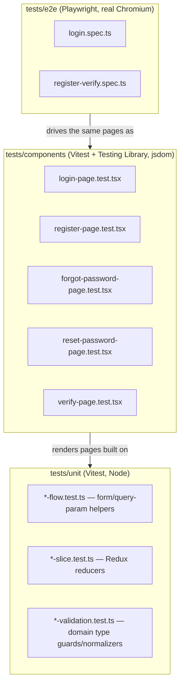

# Testing

This document describes the automated test suite that exists in the OpsDesk
repository today: what the three test layers are, exactly what each test file
covers, how to run them, and what is and is not configured around them
(coverage, CI). It is a description of what is actually in the repository, not
a target or a testing strategy proposal — gaps are called out explicitly
rather than implied to be handled elsewhere.

All claims below are grounded in `package.json`, `vitest.config.ts`,
`playwright.config.ts`, `tests/setup/vitest.setup.ts`, and the contents of
`tests/unit/**`, `tests/components/**`, and `tests/e2e/**`, plus direct test
runs performed while writing this document (see [Current suite health](#current-suite-health)).

## The three test layers

| Layer | Tool | Location | Runs in | What it exercises |
|---|---|---|---|---|
| Unit | Vitest | `tests/unit/**/*.test.ts` | Node (no DOM) | Redux slice reducers and standalone domain-logic/validation helper functions — no React rendering |
| Component | Vitest + Testing Library | `tests/components/**/*.test.tsx` | jsdom | Full page components (`app/(auth)/**/page.tsx`) rendered in isolation, with `next/navigation`, `next-auth/react`, and `sonner` mocked at the module level |
| End-to-end | Playwright | `tests/e2e/**/*.spec.ts` | Real Chromium against a running Next.js server | Full-browser flows through the same auth pages, with backend API calls intercepted via `page.route(...)` rather than hitting a real database |

There is no fourth layer (no integration tests against a real/staging
Supabase instance, no API/contract tests, no visual-regression or
accessibility-audit tooling) anywhere in the repository.

## What each test file covers

### Unit tests (`tests/unit/`, 11 files, 39 tests)

These import a plain TypeScript module directly (no rendering, no DOM) and
assert on its return value. Each file pairs 1:1 with a small,
colocated logic module rather than testing a page or an API route.

| File | Covers |
|---|---|
| `auth-slice.test.ts` | Redux `auth` slice: initial unauthenticated state, `setLoggedUser`, `clearLoggedUser` reducers |
| `customers-validation.test.ts` | `lib/customers/validation.ts` — customer status validation/normalization |
| `forgot-password-flow.test.ts` | Email normalization and the generic non-enumerating success-message constant used by the forgot-password flow |
| `login-flow.test.ts` | `hasVerifiedQuery` (reads the `?verified=true` query flag) and `mapLoginError` (maps NextAuth error codes to user-facing strings) |
| `orders-validation.test.ts` | `lib/orders/validation.ts` — order status/payment-status validation/normalization and currency-code normalization |
| `register-flow.test.ts` | Password-mismatch validation helper for the register form |
| `reset-password-flow.test.ts` | `parseRecoveryTokens` — reading Supabase recovery access/refresh tokens from either the URL hash or the query string, returning `null` when absent |
| `tickets-slice.test.ts` | Redux `tickets` slice: applying an optimistic patch to both the cached detail entry and the list entry, appending a text/attachment to a cached ticket detail without a refetch |
| `tickets-validation.test.ts` | `lib/tickets/validation.ts` — ticket status/priority/text-type validation and normalize-with-fallback helpers |
| `topbar-slice.test.ts` | Redux `topbar` slice: storing fetched `/api/me` data, incrementing the org-change-version counter, applying a created-organization payload |
| `verify-flow.test.ts` | Code-normalization (whitespace trimming) and code-matching helpers used by the (non-cryptographic, client-side-only) `/verify` page |

**Philosophy evidenced by this layer:** every non-trivial piece of client-side
logic in the auth pages (`login-flow.ts`, `register-flow.ts`,
`forgot-password-flow.ts`, `reset-password-flow.ts`, `verify-flow.ts`) was
deliberately extracted into its own small, side-effect-free module so it could
be unit-tested without rendering a component — this is a "logic-out-of-the-
component" pattern applied specifically to the auth pages. The three Redux slice
test files (`auth-slice`, `tickets-slice`, `topbar-slice` — three files, one
per slice registered in `lib/store/store.ts`) test reducers directly against
`configureStore`, independent of any component that dispatches them. The
`*-validation.test.ts` files test the type guards and fallback-normalizers
that gate what values are allowed into `tickets`/`orders`/`customers` API
payloads. Notably, this pattern (extract logic → unit test it) exists **only**
for the auth pages and the three Redux slices — no equivalent extraction/unit
test exists for orders, customers, incidents, automation, SLA, RBAC, or
reports logic (see [Coverage gaps](#coverage-gaps-what-has-zero-automated-test-coverage)).

### Component tests (`tests/components/`, 5 files, 22 tests)

These render a full page component (e.g. `app/(auth)/login/page.tsx`) with
`@testing-library/react`, in jsdom, with three modules mocked via `vi.mock()`:
`next/navigation` (router methods), `next-auth/react` (`signIn`), and `sonner`
(toast calls). No network layer (fetch, MSW, or similar) is globally mocked in
`tests/setup/vitest.setup.ts` — each test file supplies its own mocks/stubs as
needed for the specific calls the page under test makes.

| File | Covers |
|---|---|
| `login-page.test.tsx` | Form render (with a Google sign-in control), successful credential submit + redirect home, invalid-credentials error mapping, navigation to register, navigation to forgot-password, the "Email Verified" state rendered from `?verified=true` |
| `register-page.test.tsx` | Form render (with a Google sign-in control), password-mismatch validation blocking submit, successful registration + redirect to login, API-failure path surfaced in the form |
| `forgot-password-page.test.tsx` | Form render, successful email submit, API-error/toast path, navigation back to login |
| `reset-password-page.test.tsx` | Invalid-link state when recovery tokens are missing from the URL, successful password update + redirect, password-mismatch error |
| `verify-page.test.tsx` | Form render, correct-code vs. incorrect-code comparison against the `?code=` query string, navigation to login |

### End-to-end tests (`tests/e2e/`, 2 files)

These use a real Chromium instance (via Playwright) driving the actual
running app (either a dev server Playwright starts itself, or an
already-running server — see [Playwright configuration](#playwright-configuration)
below). Backend calls are intercepted with `page.route("**/api/...")` and
fulfilled with a scripted JSON response, so no test in this layer talks to a
real Supabase/NextAuth backend.

| File | Covers |
|---|---|
| `login.spec.ts` | Google sign-in control's disabled/enabled state and navigation to `/register`; navigation to `/forgot-password`; a full login submit against a mocked `**/api/auth/callback/credentials**` response, asserting redirect to `/`; an invalid-credentials response from the same mocked route surfacing "Invalid email or password"; the "Email Verified!" state rendered from `/login?verified=true`; a full forgot-password submit against a mocked `/api/auth/forgot-password` response, asserting the "Check your inbox" success state |
| `register-verify.spec.ts` | Google sign-in control's state on `/register`; password-mismatch validation; a full registration submit against a mocked `/api/auth/register` response, asserting redirect to `/login`; an API-failure response surfacing "Registration failed"; the `/verify?code=...` page correctly reporting `false`/`true` for an incorrect vs. correct entered code |

### Domains with zero test coverage of any kind

Tickets, orders, customers, incidents, automation rules, the SLA engine,
RBAC/approvals, audit logs, reports/analytics, notifications, the customer
portal, and Stripe payments have **no unit, component, or e2e tests** anywhere
in the repository. Every test file listed above concerns either an auth page
or one of the three Redux slices. See
[Coverage gaps](#coverage-gaps-what-has-zero-automated-test-coverage) below.

## Running the tests

Exact scripts, verbatim from `package.json`:

| Script | Command | Layer |
|---|---|---|
| `npm test` | `vitest run` | Unit + component (everything matched by `vitest.config.ts`'s `include` glob, i.e. both `tests/unit/**` and `tests/components/**`, in one run) |
| `npm run test:watch` | `vitest` | Same as above, in watch mode |
| `npm run test:unit` | `vitest run tests/unit` | Unit only |
| `npm run test:components` | `vitest run tests/components` | Component only |
| `npm run test:e2e` | `playwright test` | End-to-end (headless) |
| `npm run test:e2e:headed` | `playwright test --headed` | End-to-end, visible browser |

**None of these scripts load `.env.local`** (contrast with the `tinker`
scripts, which explicitly run `node --env-file=.env.local scripts/tinker.mjs`).
This matters in practice: `login/page.tsx` and `register/page.tsx` import
`lib/supabase.ts` at module scope, which calls
`createClient(process.env.NEXT_PUBLIC_SUPABASE_URL!, process.env.NEXT_PUBLIC_SUPABASE_ANON_KEY!)`
unconditionally. Verified directly: running `npx vitest run tests/components/login-page.test.tsx`
in a shell with no Supabase env vars exported throws `Error: supabaseUrl is
required.` at import time, before any test in the file runs. The test suite
therefore only works if the vars in `.env.local` (at minimum
`NEXT_PUBLIC_SUPABASE_URL` and `NEXT_PUBLIC_SUPABASE_ANON_KEY`) are already
present in the shell environment the test command runs in — there is no
`dotenv`/`--env-file` wiring in `vitest.config.ts` or the `test*` npm scripts
to guarantee that. Unit tests that don't import a page/module touching
`lib/supabase.ts` are unaffected.

## Configuration

### Vitest (`vitest.config.ts`)

- `plugins: [react()]` — `@vitejs/plugin-react`, so JSX in `.tsx` component tests transforms correctly.
- `resolve.alias["@"]` → repo root, mirroring the `"@/*": ["./*"]` path alias in `tsconfig.json` exactly — imports like `@/lib/store/slices/tickets-slice` resolve the same way in tests as in application code.
- `test.environment: "jsdom"` — a DOM is available in every test file, including the pure-logic unit tests (they simply don't use it).
- `test.globals: true` — `describe`/`it`/`expect`/`vi` are available without an explicit import.
- `test.setupFiles: ["./tests/setup/vitest.setup.ts"]` — see below.
- `test.include: ["tests/unit/**/*.test.ts", "tests/components/**/*.test.tsx"]` — this is the exact boundary that keeps Playwright specs (`tests/e2e/**/*.spec.ts`) out of Vitest's run entirely; the two tools never compete for the same files.
- `test.css: true` — CSS is processed for component tests (relevant since the pages under test import Tailwind-based UI primitives).

### `tests/setup/vitest.setup.ts`

Runs once before the suite and registers an `afterEach` hook that:
1. Calls Testing Library's `cleanup()` — unmounts anything rendered by the previous test.
2. Calls `vi.restoreAllMocks()` — resets every `vi.spyOn`/mock created during the test.
3. Calls `vi.unstubAllGlobals()` — reverts any global stubbed via `vi.stubGlobal`.

It also polyfills `window.matchMedia` with a no-op mock **only if it isn't
already defined**, since jsdom does not implement `matchMedia` natively and at
least one code path under test (theme/responsive-hook related) calls it.
This is the entire setup file — there is no global fetch mock, no MSW server,
no Supabase/NextAuth mock registered globally; each test file is responsible
for mocking what it needs.

### Playwright (`playwright.config.ts`)

- `testDir: "./tests/e2e"`.
- `baseURL`: `process.env.PLAYWRIGHT_BASE_URL ?? "http://127.0.0.1:4173"` — **port 4173**, not the `next dev` default of 3000.
- `fullyParallel: true`.
- `retries`: `2` if `process.env.CI` is set, else `0` — a hook for CI behavior that currently has nothing to invoke it (see [No CI](#no-ci)).
- `use.trace: "on-first-retry"` — a trace is only captured if a test is retried, which in practice means only in a `CI`-flagged run.
- `webServer`: **only configured when `PLAYWRIGHT_BASE_URL` is not set.** In that (default) case, Playwright itself runs `npm run dev -- --port 4173`, waits up to 120 seconds for the base URL to respond, and does **not** reuse an already-running server (`reuseExistingServer: false`) — every `npm run test:e2e` invocation starts its own fresh dev server on port 4173. If `PLAYWRIGHT_BASE_URL` is set (e.g. to point at an already-running instance), Playwright skips starting a server entirely and just runs the specs against that URL.
- `projects`: a single project, `chromium` (`devices["Desktop Chrome"]`). There is no Firefox, WebKit, or mobile-viewport project configured — cross-browser and mobile-viewport behavior is untested by this suite.

## Coverage instrumentation

**Not configured.** There is no `@vitest/coverage-v8`, `@vitest/coverage-istanbul`,
`c8`, `nyc`, or any other coverage package in `package.json`'s
`devDependencies`, no `test.coverage` block in `vitest.config.ts`, no
`--coverage` flag in any npm script, and no coverage threshold enforced
anywhere. Running `npm test` produces pass/fail results only — no line,
branch, or function coverage percentage is measured or reported by this repo
today.

## No CI

There is no `.github/workflows/` directory, no `vercel.json`, no
`Dockerfile`/`docker-compose.yml`, and no CI configuration for any other
provider (GitLab CI, CircleCI, Azure Pipelines, Bitbucket Pipelines) anywhere
in the repository. `playwright.config.ts`'s `retries: process.env.CI ? 2 : 0`
and `webServer`'s implicit `CI`-awareness are the *only* CI-shaped code in the
repo — they read a `CI` environment variable that nothing in this repository
ever sets. In practice this means:

- `npm test`, `npm run test:unit`, `npm run test:components`, and
  `npm run test:e2e` are run locally, by a developer, on demand.
- Nothing blocks a merge/push on test failure — there is no enforced quality
  gate.
- Whatever coverage and pass/fail status exists at any point in time is only
  as current as the last person who happened to run the suite locally.

If CI is added later, wiring `retries`/`CI` in `playwright.config.ts` already
half-expects it; the missing pieces are the workflow file itself and a step
that exports `NEXT_PUBLIC_SUPABASE_URL`/`NEXT_PUBLIC_SUPABASE_ANON_KEY` (see
[Running the tests](#running-the-tests)) before invoking Vitest.

## Current suite health

While writing this document, the Vitest suites were actually executed (with
`NEXT_PUBLIC_SUPABASE_URL`/`NEXT_PUBLIC_SUPABASE_ANON_KEY` exported from
`.env.local` into the shell first, per the note above) to record accurate,
present-tense pass/fail state rather than assume the suite is green. Results,
against the repository as it stands at commit `98cd095`:

- **`tests/unit`** — 11 files, 39 tests, **all passing**.
- **`tests/components`** — 5 files, 22 tests, **7 failing**:
  - `login-page.test.tsx`: **all 6 tests fail.** The mock for `next/navigation`
    only provides `useRouter`; the current `app/(auth)/login/page.tsx` also
    calls `useSearchParams()` at the top of the component (to read
    `?verified=true` and drive the MFA/verification UI states), which the
    mock doesn't export. Because the component throws during render, every
    test in the file fails, including ones unrelated to search params (e.g.
    "navigates to register when Create account is clicked").
  - `register-page.test.tsx`: **1 of 5 tests fails** — "renders register form
    with disabled Google sign-in label" looks for a button named
    `"Google sign-in (coming soon)"`, which no longer exists in
    `app/(auth)/register/page.tsx` (confirmed by direct grep: that string is
    not present in the file). The current page renders an enabled
    `"Sign in with Google"` button that calls a real
    `supabase.auth.signInWithOAuth` handler, not a disabled placeholder.
  - `forgot-password-page.test.tsx`, `reset-password-page.test.tsx`,
    `verify-page.test.tsx`: all passing.
- **`tests/e2e`** was not executed for this document (doing so spins up a dev
  server and a real browser). However, `login.spec.ts` and
  `register-verify.spec.ts` both assert on the same
  `"Google sign-in (coming soon)"` button name confirmed above to no longer
  exist in either `app/(auth)/login/page.tsx` or
  `app/(auth)/register/page.tsx` — so those specific assertions would very
  likely fail today for the same reason as the component test, though this
  was not confirmed by an actual Playwright run.

**Interpretation:** the login/register component tests (and, by strong
inference, the equivalent e2e assertions) were written against an earlier
version of the auth pages — before Google OAuth was wired up as a real,
working sign-in method (see the "Google authentication callback" and
"comprehensive authentication system" commits in the git history) and before
`login/page.tsx` grew its `useSearchParams()`-driven states. They were not
updated when those pages changed. This is a live, present-tense finding, not
a hypothetical risk: **6 of 22 component tests currently fail**, and at least
2 e2e assertions reference UI text that no longer exists in the source.
Anyone relying on `npm test` output as a signal that the auth pages work
should be aware the failures are about test staleness in these specific
assertions, not a regression in the pages themselves — but a stale, failing
test suite provides no useful signal either way, and is functionally
equivalent to auth-page changes escaping test coverage.

## Coverage gaps (what has zero automated test coverage)

Based on the file inventory of `tests/unit/`, `tests/components/`, and
`tests/e2e/` above (11 + 5 + 2 = 18 files total, all of them touching either
an auth page/flow or a Redux slice), the following areas of the product have
**no unit, component, or e2e test**:

- Tickets, ticket texts/comments, mentions, attachments, tags (API routes and UI)
- Orders, order items, order status events, Stripe payment-link/webhook handling
- Customers and the customer detail/activity timeline
- Incidents, status services, and the public status page
- The automation rules engine (all five entity-type engines) and its default/seed rules
- The SLA engine (policy CRUD, escalation sweep, compliance calculation)
- RBAC (custom roles, permission evaluation, approval-policy/approval-request flow)
- Audit logging
- Executive analytics/reports (metric computation, scheduled report delivery)
- Notifications (in-app, SSE polling stream, realtime membership guard)
- The customer portal (magic-link auth, ticket reply, order payment) — a fully separate authentication system from the one that is tested
- The dashboard, global search, saved views, and team/invite management flows
- Passkey/WebAuthn registration and authentication
- Email MFA step-up (send/verify)

In other words, automated test coverage today is limited to the credential
password/reset/verify auth pages and the Redux state layer; the ticketing,
billing, incident-management, automation, and reporting functionality that
makes up the bulk of the product has none.

## `scripts/tinker.mjs` is not a test tool

`npm run tinker` (and `tinker:list`/`tinker:users`) run
`scripts/tinker.mjs`, a Node CLI that seeds demo/fixture data directly into a
real Supabase database (via the service-role key) for local development and
manual exploration — it inserts rows across tickets, orders, incidents, SLA
policies, automation rules, communications, RBAC roles, portal sessions, and
analytics schedules. It is **not** part of the automated test suite, has no
assertions, and is not invoked by any `test*` script. It is documented here
only to prevent it from being mistaken for a test-data fixture pipeline —
none of the untested domains listed above gain any test coverage from it
existing.

## Missing information

The following could not be established from the repository as scoped and
would need input from the team before being asserted in project
documentation:

- Whether CI is planned on any particular platform (the `CI`-aware retry
  logic in `playwright.config.ts` suggests CI was anticipated, but no
  workflow file exists to confirm the intended provider).
- Whether the 7 currently-failing component tests (and the likely-failing
  e2e assertions) are already a known issue being tracked, or whether this
  document is the first record of it.
- Whether a coverage threshold or tool was ever planned/discussed but not
  yet implemented, versus not a current priority.
- Whether integration testing against a real (non-mocked) Supabase instance
  is planned for any of the untested domains.
